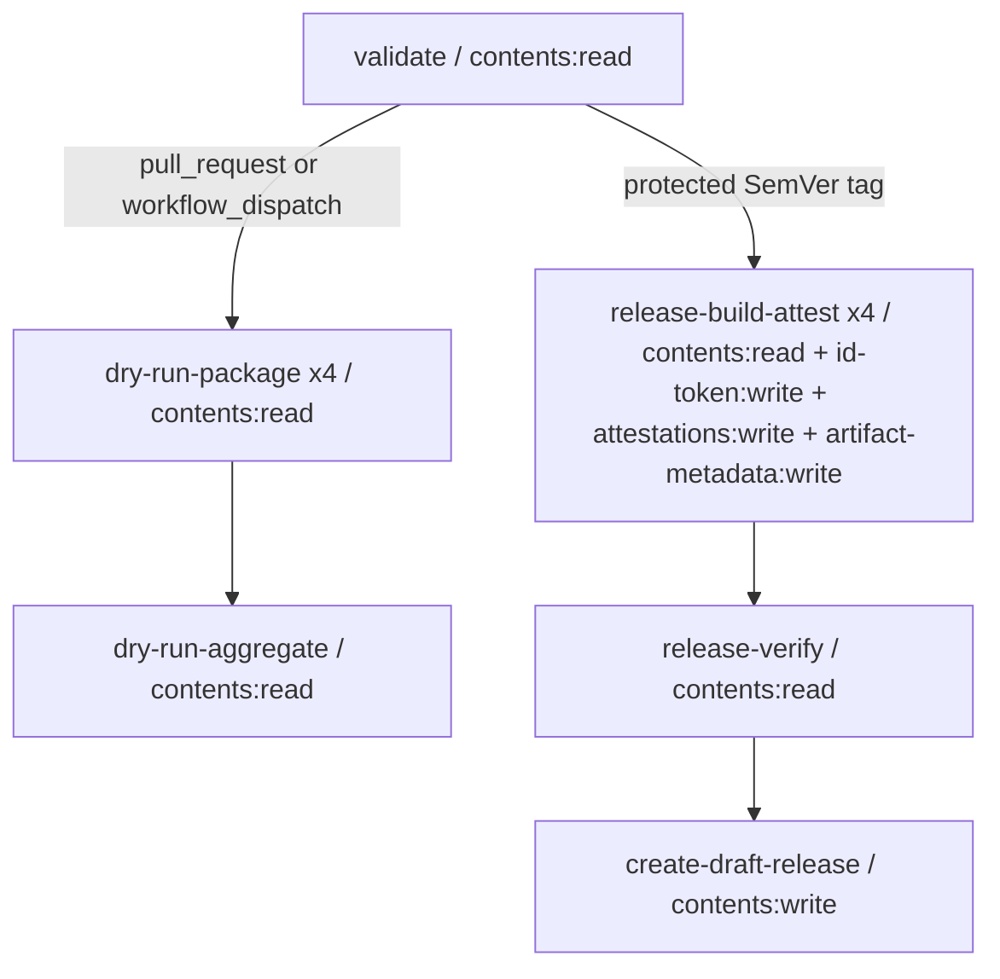

# cppseed リリース・サプライチェーン内部設計書

- 文書バージョン: 0.1
- 対象Gate: G5
- ステータス: In review
- 文書オーナー: `harutasti`
- 技術レビュー: Pending
- テスト可能性レビュー: Pending
- セキュリティレビュー: Pending
- リリース承認: Not applicable at G5
- 対象Issue: [#11](https://github.com/harutasti/cppseed/issues/11)
- 上位設計: [リリース・サプライチェーン外部設計書](external-design.md)
- ADR: [ADR-0001](adr/0001-spdx-2-3-toolchain.md)、
  [ADR-0002](adr/0002-signed-build-metadata-predicate.md)、
  [ADR-0003](adr/0003-offline-bundle-and-trusted-root.md)
- Review PR: [#23](https://github.com/harutasti/cppseed/pull/23)
- 作成日: 2026-07-16

## 1. Component structure

### 1.1 Runtime component

| Component/job/file | Responsibility | Inputs | Outputs | Failure contract |
|---|---|---|---|---|
| `.github/workflows/release.yml` | event、権限、job依存、timeout、Actions pinを宣言する | PR、dispatch、tag | dry-run evidenceまたはdraft Release | 任意の必須job失敗で後続を開始しない |
| `validate` job | source、version、tag、main ancestry、required CI、target定義を検証する | event context、repository、target manifest | `mode`、`version`、`source_sha`、matrix JSON | contract違反はbuild前に停止する |
| `dry-run-package` matrix | 未信頼eventをread-onlyで4platform buildし、署名前evidenceを作る | source、target config | target別4 assets + internal manifest | 署名、OIDC、Release操作を行わない |
| `dry-run-aggregate` job | 16 assetsと内容をrelease前に検証する | 4 target artifacts | dry-run summary | exact setまたは内容不一致で失敗する |
| `release-build-attest` matrix | tag buildから4 assetsと3 attestationをtarget別に作る | validated tag、target config、OIDC | target別5 Release assets + internal manifest | target内を直列処理し、不完全targetを成功扱いしない |
| `release-verify` job | 4 targetを集約し、online/offline policyと22-asset contractを検証する | target artifacts、GitHub attestation API | verified `dist/`、verification manifest | 1件でも不一致ならwrite権限jobへ渡さない |
| `create-draft-release` job | 検証済み22 filesだけをdraft Releaseへuploadする | verified artifact、release notes | unpublished draft Release | 既存Releaseを上書きせず、当runの不完全draftだけcleanupする |
| `.github/release/targets.json` | target、runner、archive、tool配布物の唯一の定義元 | repository review | validated matrix/config | 未知key、重複、未定義targetを拒否する |
| `.github/schemas/build-metadata-v1.schema.json` | custom predicate bodyのclosed JSON Schemaを定義する | metadata JSON | schema validation result | 未知fieldと型・pattern違反を拒否する |
| `.github/requirements/spdx-tools-0.8.5-linux-py310.txt` | SPDX validation dependencyをhash固定する | CPython 3.10、Linux x86-64 | isolated validator environment | hashなしinstallとdependency解決を許可しない |
| `.github/requirements/jsonschema-4.25.1-linux-py310.txt` | metadata schema validatorとtransitive dependencyをhash固定する | CPython 3.10、Linux x86-64 | isolated validator environment | hashなしinstallとremote schema取得を許可しない |
| `.github/scripts/release/release_lib.py` | strict JSON、hash、atomic write、safe path、diagnosticを共通化する | file/path/value | typed valueまたはatomic file | duplicate key、symlink、path escapeを拒否する |
| `.github/scripts/release/validate_context.py` | event/source/manifest contractを検証する | GitHub contextの明示allowlist | context result JSON | context不一致を分類してnon-zeroにする |
| `.github/scripts/release/acquire_tool.py` | Syft/GitHub CLIをversion・digest固定で取得する | approved tool config | isolated executable | TLS、digest、archive member、version不一致を拒否する |
| `.github/scripts/release/package-unix.sh` | macOS/Linuxのbuild、test、dependency収集、package、smoke testを行う | target config、source | archive、dependency report、build context | `set -euo pipefail` で最初の異常時に停止する |
| `.github/scripts/release/package-windows.ps1` | Windowsの同処理を行う | target config、source | archive、dependency report、build context | `$ErrorActionPreference='Stop'` と各native exit codeを確認する |
| `.github/scripts/release/transform_spdx.py` | Syft JSONをED-SC-005のSPDX 2.3へ制御変換する | raw Syft JSON、staging、archive identity | final SPDX JSON | sourceを上書きせず、全invariant成立時だけatomic renameする |
| `.github/scripts/release/generate_metadata.py` | allowlist値からbuild metadata v1を生成する | target/build context、evidence files | metadata JSON | environment全件参照を禁止し、schema違反を拒否する |
| `.github/scripts/release/validate_evidence.py` | target/release単位のschema、semantic、digestを検証する | assets、expected context | result JSON、summary row | fail-closed、warningで必須checkを代替しない |
| `.github/scripts/release/assemble_attestations.py` | 3 bundleを検査して固定順JSONLへまとめる | Actionsの3 `bundle-path` | target bundle、attestation record | exactly 3、predicate順、subject一致を要求する |
| `.github/scripts/release/aggregate_release.py` | exact set、safe copy、trusted root、checksum、verification manifestを作る | 4 target artifacts | 22 files + internal manifest | 重複、余分、不足、symlink、digest変更を拒否する |
| `.github/scripts/release/verify_attestations.sh` | 12 onlineと12 offline verificationを同一policyで実行する | archive、bundle、root、expected identity | machine-readable verification JSON | policy、network isolation、semantic equalityの違反で停止する |

### 1.2 Job graph and permission boundary



- workflow既定permissionは `contents: read` とする。
- `pull_request_target` は使用しない。fork PR codeはwrite token、OIDC token、secretへ到達しない。
- write permissionはjob単位で宣言し、条件式でtrusted/untrusted処理を同じjobへ混在させない。
- `create-draft-release` はrepository codeを実行せず、`release-verify` が作ったimmutableな
  Actions artifactの検証とuploadだけを行う。
- `strategy.fail-fast` は `false` とし、全targetの失敗情報を得る。ただし任意のmatrix failureで
  aggregate/release jobは開始しない。

### 1.3 Repository layout after G8

```text
.github/
├── release/
│   └── targets.json
├── requirements/
│   ├── jsonschema-4.25.1-linux-py310.txt
│   └── spdx-tools-0.8.5-linux-py310.txt
├── schemas/
│   └── build-metadata-v1.schema.json
├── scripts/
│   └── release/
│       ├── acquire_tool.py
│       ├── aggregate_release.py
│       ├── assemble_attestations.py
│       ├── generate_metadata.py
│       ├── package-unix.sh
│       ├── package-windows.ps1
│       ├── release_lib.py
│       ├── transform_spdx.py
│       ├── validate_context.py
│       ├── validate_evidence.py
│       └── verify_attestations.sh
└── workflows/
    └── release.yml
```

G5では設計文書だけを追加する。上記実装fileはG8まで空fileとして先行作成しない。

## 2. Internal interfaces

### DD-SC-001: Target manifest

- Related design: `ED-SC-002`、`ED-SC-003`、`ED-SC-010`
- Interface: `.github/release/targets.json`
- Preconditions: repository review済みのUTF-8 JSON、schemaVersion 1
- Postconditions: 4 targetを一意なmatrixへ変換でき、asset名を他の定数なしで導出できる
- Error handling: strict parseし、duplicate key、未知key、target/id/runner重複、exactly 4以外を失敗させる

実装時の初期値を次に固定する。URLは `https://github.com/anchore/syft/releases/download/` と
`https://github.com/cli/cli/releases/download/` の固定prefix、version、asset名からだけ導出する。

| id | runner / target | archive | generator / options | Syft asset / SHA-256 |
|---|---|---|---|---|
| `macos-arm64` | `macos-15` / `aarch64-apple-darwin` | `tar.gz` | `Unix Makefiles`; `CMAKE_OSX_DEPLOYMENT_TARGET=13.0` | `syft_1.46.0_darwin_arm64.tar.gz`; `cd4e2c40e075684a5746d8959f76b6572bb2d2dda8cf6877dbfff1cc0baeea01` |
| `macos-x64` | `macos-15-intel` / `x86_64-apple-darwin` | `tar.gz` | `Unix Makefiles`; `CMAKE_OSX_DEPLOYMENT_TARGET=13.0` | `syft_1.46.0_darwin_amd64.tar.gz`; `5c983db13533de02e5331aae88091116f25365840741f86234084a30166672a7` |
| `linux-x64` | `ubuntu-22.04` / `x86_64-unknown-linux-gnu` | `tar.gz` | `Unix Makefiles`; no target-specific option | `syft_1.46.0_linux_amd64.tar.gz`; `d654f678b709eb53c393d38519d5ed7d2e57205529404018614cfefa0fb2b5ca` |
| `windows-x64` | `windows-2025` / `x86_64-pc-windows-msvc` | `zip` | `Visual Studio 17 2022`; `CMAKE_MSVC_RUNTIME_LIBRARY=MultiThreaded` | `syft_1.46.0_windows_amd64.zip`; `1e515c1ac4bc65917f8d0a52b6ae0e611082779cbf2da9d470282158dd24ea13` |

top-levelは `schemaVersion`、`tools`、`requiredChecks`、`targets` だけを持つclosed objectとする。
targetは `id`、`runner`、`target`、`format`、`executable`、`cmakeGenerator`、`cmakeOptions`、
`dependencyMethod`、`syftAsset`、`syftSha256` を持つclosed objectとする。`cmakeOptions` は名前昇順の
`NAME=VALUE` 配列とし、shell command文字列を保存しない。

`requiredChecks` は次の8 closed objectsをname順で持ち、各entryの `appSlug` を `github-actions` とする。

```text
Linux Clang
Linux GCC
Windows MSVC
coverage
docs
macOS Apple Silicon
macOS Intel
performance
```

現行rulesetがstatus checkを必須化していない場合でも、tag workflowはこの集合を独立したrelease gateとして
強制する。G10ではruleset側も同じ集合へ合わせ、workflow検査との二重controlにする。

### DD-SC-002: Event and source context validation

- Related design: `ED-SC-001`、`ED-SC-010`、`ED-SC-011`
- Interface: `validate_context.py --event <event.json> --manifest <targets.json> --output <result.json>`
- Preconditions: checkoutはfull history、dispatchだけは明示されたref、その他はevent refをcheckout済み
- Postconditions: resultは `mode=dry-run|release`、version、40文字source SHA、source ref、matrixを持つ
- Error handling: process exitは0/2/3/4に限定し、詳細はsection 5のdiagnostic IDでstderrへ出す

`release` modeでは次をすべて検証する。

1. refが `refs/tags/vX.Y.Z`、tag名が `^v[0-9]+\.[0-9]+\.[0-9]+$`
2. `git cat-file -t refs/tags/<tag>` が `tag` でありlightweight tagではない
3. `git rev-list -n 1 <tag>`、checkout `HEAD`、event source SHAが同じcommit
4. source commitが `origin/main` のancestor
5. CMake project version、tag、release notes filenameが一致
6. repository visibilityがpublic
7. source commitに対しDD-SC-001の8 CI checksが `app.slug=github-actions`、`status=completed`、
   `conclusion=success`

required checkの取得はGitHub REST APIのsource SHAに対するcheck runsを使用する。同名の複数runがある
場合は全件のapp slugを検査し、少なくとも1件のsuccessだけでなく、同一appの最新runがsuccessであることを
要求する。API応答が曖昧、未完了、取得不能の場合もreleaseを停止する。PR/dispatchはこのtag条件を要求せず、
CMake versionと入力versionの形式だけを検証する。

### DD-SC-003: Generated names and exact asset set

- Related design: `ED-SC-002`、`ED-SC-003`、`ED-SC-004`
- Interface: pure functions in `release_lib.py`
- Preconditions: DD-SC-001/002で検証済みversionとtarget
- Postconditions: platform当たり4 dry-run names、5 release names、release-wide 2 namesを返す
- Error handling: path separator、NUL、空白制御文字、255 bytes超、basename以外を拒否する

生成規則は次のpure functionとし、YAMLやshellへfilename literalを複製しない。

```text
archive(version, target, format)
sbom(archive)       = archive + ".spdx.json"
metadata(archive)   = archive + ".build-metadata.json"
dependencies(archive) = archive + ".dependencies.txt"
bundle(archive)     = archive + ".attestations.jsonl"
root(version)       = "cppseed-v" + version + "-trusted-root.jsonl"
checksums()         = "SHA256SUMS"
```

dry-run exact setは16、releaseのnon-checksum setは21、最終setは22とする。GitHub自動生成のsource
archivesは比較対象に含めない。

### DD-SC-004: Platform build and packaging

- Related design: `ED-SC-002`、`ED-SC-011`、`ED-SC-012`
- Interface: OS別package scriptへtarget config JSONとoutput directoryを渡す
- Preconditions: clean checkout、version/source一致、target専用の空temporary directory
- Postconditions: immutable archive、dependency report、allowlist build contextを生成しsmoke testが成功する
- Error handling: partial outputはtarget temporary directoryだけに残し、成功時にoutputへatomic moveする

処理順はconfigure、build、CTest、binary version、staging作成、dependency inspection、archive作成、
archive展開、CLI help/version、generated project configure/build/CTestの順とする。stagingのexact contentは
Unixが `cppseed`、Windowsが `cppseed.exe`、共通で `LICENSE` と `README.md` の3 filesである。

archiveを作成した時点でread-onlyとして扱い、その後の処理はhash/readだけを許可する。dependency
reportはmacOSで `/usr/lib` と `/System/Library` 以外、Linuxで `not found`、Windows static runtimeで
`VCRUNTIME`/`MSVCP` を許可しない。allowlistはG7でOSごとのpositive/negative fixtureへ具体化する。

### DD-SC-005: Pinned tool acquisition

- Related design: `ED-SC-005`、`ED-SC-008`、`ED-SC-009`
- Interface: `acquire_tool.py --tool syft|gh --config ... --output-dir ...`
- Preconditions: approved HTTPS host、fixed version/asset/digest、空output directory
- Postconditions: exact memberだけを展開し、実行versionが期待値と一致する
- Error handling: redirect先host、TLS、download、size、SHA-256、member、versionの1件でも違えば削除して失敗する

archive extractionはbasenameが `syft`、`syft.exe` または `gh` の単一regular fileだけを許可し、
absolute path、`..`、symlink、hardlink、device、重複memberを拒否する。download上限は100 MiB、展開後は
150 MiBとする。runnerの既存PATHへinstallせず、run専用directoryのabsolute executable pathを使う。

Ubuntu verifier用GitHub CLIは `2.96.0`、asset
`gh_2.96.0_linux_amd64.tar.gz`、SHA-256
`83d5c2ccad5498f58bf6368acb1ab32588cf43ab3a4b1c301bf36328b1c8bd60` に固定する。

### DD-SC-006: SPDX generation and controlled transformation

- Related design: `ED-SC-005`、ADR-0001
- Interface: `transform_spdx.py --raw <raw.json> --staging <dir> --archive <file> --context <json> --output <file>`
- Preconditions: Syft 1.46.0を `dir:<staging>`、file metadata SHA-1/SHA-256有効で実行済み
- Postconditions: ED-SC-005を満たすUTF-8/LF SPDX 2.3 JSONをatomic生成する
- Error handling: raw JSON、entity選択、digest、relationship、validationの不一致ではoutputを作らない

変換algorithmは次のとおりとする。

1. duplicate keyを拒否してraw JSONをparseし、`SPDX-2.3`、`CC0-1.0` を確認する
2. stagingをsymlink追跡なしで列挙し、期待3 regular files以外を拒否する
3. name/versionが一致するroot packageをexactly 1件選ぶ。0件または複数は失敗する
4. Syftが検出した未知package、file、relationshipは保持し、ID衝突だけを失敗させる
5. archive File entityを追加し、SHA-1/SHA-256を実fileから再計算する
6. 3 content File entityのSHA-1/SHA-256をstagingから再計算し、scanner値と比較する
7. document `DESCRIBES` package、package `CONTAINS` archive、archive `CONTAINS` 3 content filesを
   exactly 1本ずつ持たせる
8. namespace、target、dependency report filename、scanner limitationを固定field/commentへ設定する
9. package、file、relationshipをSPDXIDまたは `(spdxElementId, relationshipType, relatedSpdxElement)` の
   byte順で安定sortする
10. atomic temporary fileへ `sort_keys=True`、indent 2、UTF-8、LF、末尾newlineで出力する

`packageVerificationCode` の対象File集合は、root distribution packageが直接 `CONTAINS` する単一の
archive File entityとする。archiveが `CONTAINS` する3 content filesは入れ子の内容を説明するentityであり、
root packageの直接File集合へ重複計上しない。したがって値はarchiveの小文字SHA-1 hex 40文字をASCII byte列
としてSHA-1化した小文字hexとなり、excludedFilesは空とする。これはG2の成立確認と同じ計算である。
G7ではrelationshipから対象集合を独立導出して再計算し、content fileまたはarchive relationshipの改変も
失敗させる。SPDX Toolsのmodel/schema validationも必須とする。

### DD-SC-007: Build metadata v1 generation

- Related design: `ED-SC-006`、ADR-0002
- Interface: `generate_metadata.py --target-config ... --build-context ... --archive ... --sbom ... --dependencies ... --source-context ... --output ...`
- Preconditions: archive/SBOM/dependency reportが確定し、build job内の明示allowlist contextがある
- Postconditions: schemaVersion 1のclosed JSON objectを生成し、全evidence digestを実fileから計算する
- Error handling: environment dump、unknown key、禁止pattern、schema/digest違反ではoutputを作らない

build contextはpackage scriptが次だけを記録するclosed JSON objectとする。

- runner: OS、architecture、image OS/version、kernelまたはWindows build
- compiler: nameと1行へ正規化したversion
- CMake: versionと実際のgenerator
- build options: manifestの名前昇順 `NAME=VALUE`
- dependency method: `ldd`、`otool -L`、`dumpbin /dependents` のいずれか
- artifact created time: archive確定直後に取得したUTC秒精度のRFC 3339時刻

generatorはprocess environmentを走査せず、GitHub contextもYAMLから明示引数として渡された値だけを
受け取る。schemaはJSON Schema Draft 2020-12、全objectで `additionalProperties: false`、全列挙値で
`enum`、digest/source SHAでlowercase hex pattern、timestampでUTC `YYYY-MM-DDTHH:MM:SSZ` を要求する。
数値に見えるrun ID/attemptも外部contractどおりdecimal stringとして保持する。

禁止検査はserialized valueに対し、大文字小文字を無視した `token|secret|password|credential|private[_-]?key`、
URL userinfo、PEM private key marker、workspace/home/tempの実absolute prefixを検出する。field名自体の
`tools` など誤検知しないようvalueへ適用し、検出値はlogへ再出力しない。

### DD-SC-008: Target evidence validation

- Related design: `ED-SC-004`、`ED-SC-005`、`ED-SC-006`、`ED-SC-012`
- Interface: `validate_evidence.py target --mode dry-run|release --expected <context> --directory <dir>`
- Preconditions: target output directoryはproducer jobだけが書込み、validator実行中は変更しない
- Postconditions: exact set、schema、semantic、digest、smoke evidenceを検証したresult JSONを返す
- Error handling: first failureに加え最大50件の独立違反を収集し、非zeroでtargetを失敗させる

dry-runでは4 files、releaseではbundleを含む5 filesを要求する。archive SHA-256を基準値とし、SPDX
archive File、metadata `artifact.sha256`、各attestation subjectを同じ値へ収束させる。platform jobでは
stdlibだけでstrict parse、closed field、digest、relationshipを検証する。Linux専用lockを使用するSPDX
ToolsとJSON Schema Draft 2020-12の正式validationは、dry-run/releaseのUbuntu aggregatorで4 targetすべてへ
実行する。schema `$schema` はvalidator同梱meta-schemaへ解決し、networkから取得しない。

### DD-SC-009: Attestation generation

- Related design: `ED-SC-007`、`ED-SC-010`、ADR-0002
- Interface: tag限定 `actions/attest@a1948c3f048ba23858d222213b7c278aabede763`
- Preconditions: package/test/SBOM/metadata/target validationが同じGitHub-hosted jobで成功済み
- Postconditions: 同一archive subjectにprovenance、SPDX、metadataの3 attestationを発行する
- Error handling: action failure、output path/ID/URL不足でtarget jobを停止し、retryは同じimmutable archiveに限定する

順序はprovenance、SBOM、metadataとする。各stepへarchive pathを `subject-path` として渡す。provenanceは
predicate inputなし、SBOMは `sbom-path`、metadataは `predicate-path` とcustom `predicate-type` を使う。
actionはfull commit SHAとversion commentの両方を記載する。返された `bundle-path`、`attestation-id`、
`attestation-url` はinternal attestation recordへ保存するが、absolute pathはbasenameへ正規化する。

### DD-SC-010: Bundle assembly

- Related design: `ED-SC-007`、`ED-SC-009`、ADR-0003
- Interface: `assemble_attestations.py --archive ... --provenance ... --sbom ... --metadata ... --output ... --record ...`
- Preconditions: DD-SC-009の3 outputsと確定archive digestが存在する
- Postconditions: exactly 3 compact JSON objectsを固定順・LF区切り・末尾LFで出力する
- Error handling: multi-object input、未知predicate、順序、subject name/digest、重複bundleを拒否する

各action bundleをstrict JSON objectとしてparseし、DSSE statementからpredicate typeとsubjectを取得する。
検証済みobjectを再serializeし、1行目provenance、2行目SPDX、3行目metadataとする。signed bytesはbundle
内部に保持されるため、外側JSONのkey順を変えても署名対象payloadを変更してはならない。

### DD-SC-011: Actions artifact handoff

- Related design: `ED-SC-010`、`ED-SC-012`、`ED-SC-013`
- Interface: `actions/upload-artifact` / `actions/download-artifact` のreview済みfull SHA
- Preconditions: target validator成功、directory内にsymlinkなし
- Postconditions: target別artifactが `release-<mode>-<target-id>-<run-attempt>` で7日保持される
- Error handling: `if-no-files-found: error`、同名上書き禁止、download後に全digestを再検証する

artifact構造は `release/` と `internal/` を分離する。`release/` だけがRelease候補であり、`internal/` は
target manifest、attestation ID/URL、tool stdout summary、elapsed timeを保持する。downloadは4 targetの
exact artifact名を指定し、globによる未知artifactのmergeをしない。

### DD-SC-012: Release aggregation and trusted root

- Related design: `ED-SC-003`、`ED-SC-004`、`ED-SC-009`、`ED-SC-012`
- Interface: `aggregate_release.py collect ...` と pinned `gh attestation trusted-root`
- Preconditions: 4 release target artifactsがtarget validation成功済み
- Postconditions: 20 target assets、1 trusted root、1 `SHA256SUMS` を新しい`dist/`へ確定する
- Error handling: regular file以外、basename衝突、期待外file、copy中digest変化、root取得失敗を拒否する

copyはsourceをhashし、exclusive-createでdestinationへ書き、再hash一致後にrenameする。trusted rootは3
attestation × 4 targetの発行後に1回だけ取得し、non-empty JSONLで各行がstrict JSON objectであることを
確認する。root取得失敗をcached dataや空fileで代替しない。

21 filesが確定した後、filename UTF-8 byteの `LC_ALL=C` 相当順で
`<sha256><space><space><basename>\n` を書く。SHA256SUMS自身は含めない。internal verification manifestは
22 filename、size、SHA-256、source SHA、run identityを持つが、Release assetには含めない。

### DD-SC-013: Online attestation verification

- Related design: `ED-SC-008`、`ED-SC-012`
- Interface: pinned `gh attestation verify <archive> --format json`
- Preconditions: network、read token、expected repository/workflow/tag/commit/predicateが明示されている
- Postconditions: 3 predicate × 4 targetの12 policy checksが成功し、verified statementを保存する
- Error handling: zero result、limit到達、複数resultのpolicy差、JSON不正、semantic違反を拒否する

各commandに次を常に付ける。

```text
--repo harutasti/cppseed
--signer-workflow harutasti/cppseed/.github/workflows/release.yml
--signer-digest <source-sha>
--source-ref refs/tags/v<version>
--source-digest <source-sha>
--predicate-type <one expected type>
--deny-self-hosted-runners
--format json
```

`--limit` は30とし、30件返った場合は候補truncationの可能性として失敗する。全resultのsubject name/digest
とidentityを検査し、SBOM/metadataでは少なくとも1件のsigned predicateが公開JSONとstrict JSONの意味で
等しいことを要求する。過去rerunの同digest statementは許可するが、異なるsource/ref/workflowはCLI
policyで除外する。

### DD-SC-014: Offline attestation verification

- Related design: `ED-SC-009`、`ED-SC-012`、ADR-0003
- Interface: DD-SC-013と同じcommandに `--bundle` と `--custom-trusted-root` を追加する
- Preconditions: target bundle、release root、archive、pinned GitHub CLIだけがlocalにある
- Postconditions: 12 checksがtokenとnetworkなしで成功し、onlineと同じsubject/predicateを返す
- Error handling: networkへfallbackした形跡、bundle/root/policy不一致、online/offline semantic差を拒否する

offline subprocessは `GH_TOKEN`、`GITHUB_TOKEN` をunsetし、`HTTP_PROXY`、`HTTPS_PROXY`、`ALL_PROXY` を
`http://127.0.0.1:9`、`NO_PROXY` を空にする。外部network observationはG7で追加し、少なくともcommandが
local bundle/rootを明示し、API tokenなしで成功することをG8 CI gateとする。3 predicateを個別に検証し、
online/offlineのnormalized subjectとpredicateを比較する。

### DD-SC-015: Final release-set verification

- Related design: `ED-SC-003`、`ED-SC-004`、`ED-SC-012`
- Interface: `aggregate_release.py verify-final --directory dist --manifest internal.json`
- Preconditions: DD-SC-012からDD-SC-014がすべて成功済み
- Postconditions: exact 22 files、21 checksum lines、全semantic mappingを固定したverified artifactをuploadする
- Error handling: verification中のmtime/size/digest変更をtamperとして失敗させる

check順はsafe path、exact names、size limit、strict formats、SHA256SUMS、archive mapping、SPDX、metadata、
bundle、online result、offline result、internal manifestの順とする。Actions artifact upload後にartifact digestを
job summaryへ記録する。

### DD-SC-016: Draft Release creation

- Related design: `ED-SC-001`、`ED-SC-011`、`ED-SC-013`
- Interface: `gh release create <tag> <22 explicit paths> --draft --verify-tag --notes-file ...`
- Preconditions: write jobがverified artifactをdownloadし、DD-SC-015を再実行している
- Postconditions: tag/sourceに対応するunpublished draftがexact 22 uploaded assetsを持つ
- Error handling: 同tag Releaseが既にあれば変更せず停止する。current run作成のpartial draftだけ削除する

shell globをupload引数にせず、verification manifestから22 basenameを読み、directory固定のargvとして渡す。
create前にRelease不存在をAPIで確認し、create成功後に `created_by_this_run=true` とする。upload後はAPIから
draft状態、tag、target commitish、asset名、sizeを再取得する。不一致時のtrapは同run作成かつ未公開draft
だけを削除し、既存またはpublic Releaseを削除しない。public化はworkflow外の手動G12操作である。

### DD-SC-017: Idempotency and rerun identity

- Related design: `ED-SC-013`
- Interface: workflow concurrency、run ID/attempt、internal manifests
- Preconditions:同じtagの失敗runまたは新しいtag
- Postconditions: 同一run attempt内でtarget/artifact名が衝突せず、公開済みversionは変更されない
- Error handling:既存draft、異なるdigestのorphan attestation、古いActions artifactを自動採用しない

正式runのconcurrency groupはrepositoryと完全tag refで構成し `cancel-in-progress: false` とする。同じtagの
rerunは新しいrun attempt名でActions artifactを作り、当attemptの4 artifactsだけを集約する。attestationは
削除せず、archive/source/workflow/predicate policyで選別する。archive byteが変わる修正はtagを再利用せず、
新しいcommitとpatch versionを必要とする。

### DD-SC-018: Strict data and path handling

- Related design: `ED-SC-004`、`ED-SC-006`、`ED-SC-012`
- Interface: `release_lib.py`
- Preconditions: callerがexpected root、filename set、maximum sizeを指定する
- Postconditions: duplicate keyなしJSON、root配下regular file、constant-time不要のdigest comparisonを提供する
- Error handling: parse/path errorを呼出元へtyped exceptionとして返し、partial outputを残さない

JSON decoderはobject pairsを検査してduplicate keyを拒否する。file inputは `lstat` でregular fileを要求し、
symlinkを追跡しない。resolve後pathがexpected root外なら拒否する。atomic writeは同directoryのrandom temporary
fileへwrite、flush、close、permission設定、`os.replace` の順とする。公開file permissionはUnix 0644、
archive内binaryは0755とする。

### DD-SC-019: Diagnostic and process exit contract

- Related design: `ED-SC-012`、`ED-SC-013`
- Interface: scripts stderr、result JSON、job summary
- Preconditions: component namespaceとsafe message templateが定義済み
- Postconditions: maintainerがfailure stageとrecovery起点をsecretなしで判別できる
- Error handling: unexpected exceptionもstack traceやenvironmentを公開せずcomponent IDを出してnon-zeroにする

Python CLIのexit codeは0 success、2 usage/config、3 input/schema contract、4 integrity/semantic mismatch、
5 external dependency/service failureとする。diagnosticは次のnamespaceを使う。

| Prefix | Component |
|---|---|
| `SC-CTX` | event/source/tag validation |
| `SC-PKG` | build/package/smoke |
| `SC-TOOL` | tool acquisition/version |
| `SC-SPDX` | SPDX transform/validation |
| `SC-META` | metadata/schema/privacy |
| `SC-ATT` | attestation/bundle/identity |
| `SC-ASSET` | aggregation/checksum/exact set |
| `SC-PUB` | draft create/upload/cleanup |

stderr形式は `error[SC-<AREA>-NNN]: <redacted message>` とし、basename、target ID、expected/actual digest、
public URLは記録できる。token、header、environment dump、home/workspace/temp absolute pathは記録しない。

### DD-SC-020: Workflow pins and change control

- Related design: `ED-SC-010`、`ED-SC-014`
- Interface: all `uses:` and tool/dependency lock entries
- Preconditions: upstream release、license、source repository、release notesをreview済み
- Postconditions: mutable tagなしで同じaction/tool versionを取得できる
- Error handling: unpinned `uses:`、hashなしPython dependency、digestなしbinary downloadをCI lintで拒否する

actionは40文字commit SHAとrelease version commentで固定する。updateは専用PRでrelease notes、permission、
output contract、license、G2/G7 regressionをreviewし、digest/version/comment/lockを同時更新する。

## 3. Algorithms and processing order

### 3.1 Pull request / dispatch dry run

1. checkoutとDD-SC-002 context validation
2. DD-SC-001 manifestからexact 4-entry matrixを生成
3. 各runnerでDD-SC-004 package/smoke
4. SyftをDD-SC-005で取得しstagingをscan
5. DD-SC-006でSPDXを生成
6. DD-SC-007でmetadataを生成
7. DD-SC-008でtargetの4 assetsを検証
8. DD-SC-011でread-only Actions artifactへ保存
9. Ubuntu aggregatorが4 artifacts、16 filenames、digest/schema/semantic mappingを再検証
10. target別Pass/Fail、digest、version、時間をjob summaryへ出して終了

dry-runはattestation、trusted root、GitHub Release APIへのwriteを実行しない。

### 3.2 Protected tag release

1. annotated tag、main ancestry、required CI、public repositoryをDD-SC-002で検証
2. 各runnerでpackageからmetadataまでdry-runと同じbyte pathを実行
3. target evidenceをDD-SC-008で検証
4. archiveを共通subjectとしてDD-SC-009の3 attestationを直列発行
5. DD-SC-010でtarget bundleを作り、5 assetsを再検証してtarget artifactへ保存
6. Ubuntu verifierが当attemptの4 target artifactsだけを取得
7. safe copyとexact 20 target assetsを検証
8. pinned GitHub CLIでtrusted rootを1回取得
9. 12 online verificationを実行
10. token/networkを除去して12 offline verificationを実行
11. SBOM/metadata predicate、online/offline resultの意味的同一性を比較
12. verified 21 filesからSHA256SUMSを作りexact 22 filesを確定
13. final validationとinternal verification manifestを作成しActions artifactへ保存
14. write-only jobがartifactを再検証し、unpublished draftへ22 explicit pathsをupload
15. APIでdraftとasset setを再検証し、maintainerの手動公開を待つ

### 3.3 Atomicity invariant

```text
temporary staging
  -> immutable archive
  -> SBOM + metadata
  -> three signed statements
  -> target bundle
  -> release aggregation + trusted root
  -> online/offline verification
  -> SHA256SUMS + final manifest
  -> draft upload
```

矢印の後で左側のfileが変化した場合、右側を部分更新せず、そのtargetのarchive作成からやり直す。
公開済みReleaseではやり直さず、新patch releaseへ進む。

## 4. Validation rules

G7では次のIDをtest plan/traceabilityへ引き継ぎ、normal、boundary、negative、tamper fixtureを具体化する。

| Input/artifact | Rule | Error | Test ID |
|---|---|---|---|
| target manifest | closed schema、exact 4、全id/target一意 | `SC-CTX-001` | `TC-SC-001` |
| version/tag | SemVer、CMake、notes一致 | `SC-CTX-002` | `TC-SC-002` |
| formal tag | annotated、main ancestor、source SHA一致 | `SC-CTX-003` | `TC-SC-003` |
| required CI | exact source SHAのrequired checksがsuccess | `SC-CTX-004` | `TC-SC-004` |
| archive | exact name/content、version/help/smoke成功 | `SC-PKG-001` | `TC-SC-005` |
| dependency report | method一致、未解決/禁止dependencyなし | `SC-PKG-002` | `TC-SC-006` |
| tool download | host/version/asset/SHA-256/member一致 | `SC-TOOL-001` | `TC-SC-007` |
| raw/final SPDX | strict JSON、SPDX 2.3、schema/model valid | `SC-SPDX-001` | `TC-SC-008` |
| SPDX entities | package 1、archive 1、content 3、関係一意 | `SC-SPDX-002` | `TC-SC-009` |
| verification code | direct archive FileのSHA-1から独立再計算一致 | `SC-SPDX-003` | `TC-SC-010` |
| metadata | v1 closed schema、allowlist、privacy pattern | `SC-META-001` | `TC-SC-011` |
| metadata evidence | archive/SBOM/dependency digest一致 | `SC-META-002` | `TC-SC-012` |
| attestation | 3 expected predicates、同一subject/source | `SC-ATT-001` | `TC-SC-013` |
| target JSONL | exactly 3 valid lines、固定順、未知なし | `SC-ATT-002` | `TC-SC-014` |
| online verification | 12件、全identity constraint、hosted runner | `SC-ATT-003` | `TC-SC-015` |
| offline verification | 12件、bundle/rootのみ、onlineと同義 | `SC-ATT-004` | `TC-SC-016` |
| dry-run assets | exact 16、署名/write side effectなし | `SC-ASSET-001` | `TC-SC-017` |
| release assets | exact 22、regular basename filesのみ | `SC-ASSET-002` | `TC-SC-018` |
| SHA256SUMS | 21 sorted unique lines、全digest一致 | `SC-ASSET-003` | `TC-SC-019` |
| draft | unpublished、tag/source/22 assets一致 | `SC-PUB-001` | `TC-SC-020` |
| partial failure | incomplete draftだけcleanup、既存は不変 | `SC-PUB-002` | `TC-SC-021` |
| permission | PR/dispatch read-only、tag jobだけ最小write | `SC-CTX-005` | `TC-SC-022` |
| rerun | current attemptのみ集約、orphanを誤採用しない | `SC-ATT-005` | `TC-SC-023` |
| published immutability | asset差替えなし、新versionで修正 | `SC-PUB-003` | `TC-SC-024` |
| dependency/action pin | full SHA + version comment、binary/lock hash固定 | `SC-TOOL-002` | `TC-SC-025` |
| log/summary | token、secret、absolute private pathを含まない | `SC-META-003` | `TC-SC-026` |
| resource/performance | size/timeout上限内、追加時間の測定値を記録 | `SC-ASSET-004` | `TC-SC-027` |

## 5. Logging and evidence

### 5.1 Job summary

summaryは次のpublic値だけを出力する。

- event mode、version、source ref、40文字source SHA、workflow run URL/attempt
- target、runner label、archive filename、archive SHA-256、size
- compiler、CMake、Syft、SPDX Tools、GitHub CLI、Actions attest version
- package、SBOM、metadata、attestation、online/offline verificationのPass/Failと経過秒
- attestation ID/URL、Actions artifact ID/digest、draft URL
- failed diagnostic IDと安全なrecovery起点

raw command outputはActions logへ必要最小限に出し、tool acquisition response header、token、API request
header、full environment、absolute local pathを出さない。GitHubのtoken maskingだけへ依存せず、scriptが
値をlogへ渡さない設計とする。

### 5.2 Internal and long-term evidence

| Evidence | Storage | Retention |
|---|---|---|
| target/internal manifests | Actions artifact | 7 days |
| final verification manifest/results | Actions artifact + G9 test report summary | 7 days + repository lifetime |
| CI logs and summary | GitHub Actions | repository policy |
| source/tag/workflow | Git repository | repository lifetime |
| 22 release assets、notes、draft/public state | GitHub Release | release lifetime |
| signed statements/transparency evidence | GitHub/Sigstore + offline bundle | service policy + release lifetime |

Actions artifactはdebugging用であり、長期検証はRelease assets、repository内G9/G11報告、tag、attestation
serviceへ依存する。公開後のrun URL、asset digest、最終判定はG13でIssueとtest reportへ記録する。

## 6. Resource and performance design

| Resource | Limit/design |
|---|---|
| `validate` timeout | 5 minutes |
| platform build/attest timeout | 30 minutes/target |
| dry-run aggregate timeout | 10 minutes |
| release verification timeout | 20 minutes |
| draft creation timeout | 10 minutes |
| matrix concurrency | 4 GitHub-hosted runners、fail-fast false |
| target Actions artifact | 100 MiB以下を初期上限 |
| final 22-assets artifact | 400 MiB以下を初期上限 |
| JSON input | 25 MiB/file、JSONL 50 MiB/file以下 |
| tool download | compressed 100 MiB、extracted 150 MiB以下 |
| verification query | predicate当たり最大30 statements、到達時fail |
| added elapsed time target | platform build以外のcritical path合計10分以内 |

全size limitはG7 fixtureとG9実測で妥当性を確認し、正常成果物の2倍以上の余裕がない場合はG5をrevision
する。performance summaryはbuild時間とsupply-chain追加時間を分け、3回の正式相当dry runの中央値を報告する。

## 7. Dependencies

| Dependency | Version/pin | License | Trust reason | Update method |
|---|---|---|---|---|
| GitHub-hosted runners | exact labels in DD-SC-001 | GitHub service | clean ephemeral environment、OIDC identity | label/image変更を設計・G7 compatibility review |
| `actions/checkout` | current reviewed full SHA + version comment | MIT | source checkout、既存CIで使用 | dedicated dependency PR |
| `actions/setup-python` | reviewed full SHA + version comment | MIT | isolated validation Python | dedicated dependency PR |
| `actions/upload-artifact` | reviewed full SHA + version comment | MIT | job間handoffとartifact digest | dedicated dependency PR |
| `actions/download-artifact` | reviewed full SHA + version comment | MIT | exact target artifact取得 | dedicated dependency PR |
| `actions/attest` | `a1948c3f048ba23858d222213b7c278aabede763` (v4.1.1) | MIT | GitHub OIDC/Sigstore integration、G2成立 | permission/output review + G2 regression |
| Syft | 1.46.0 + DD-SC-001 asset SHA-256 | Apache-2.0 | multi-platform SPDX scanner、G2成立 | upstream notes/license/digest + SBOM regression |
| SPDX Tools | 0.8.5 + all transitive hashes | Apache-2.0 | SPDX parser/model/schema validation、G2成立 | lock regenerate on pinned Python/runner |
| jsonschema | 4.25.1 + all transitive hashes | MIT | metadata Draft 2020-12 schema validation | lock regenerate on pinned Python/runner |
| CPython | runner-provided 3.10.x for SPDX validator | PSF-2.0 | locked environment baseline | patch range CI + lock compatibility |
| GitHub CLI | 2.96.0 + SHA-256 in DD-SC-005 | MIT | online/offline attestation policy CLI、G2成立 | official checksum + backward verification |
| CMake/compiler/archive tools | runner image + captured actual version | respective upstream | existing supported build toolchain | runner update PR + 4platform CI |

G8で既存Actions SHAを再利用する場合も、release workflowにversion commentを残す。新dependencyを追加する
場合はlicense、source、pin、必要permission、network endpoint、update/rollback方法を本表へ追加する。

## 8. Failure cleanup and retry

| Failure point | Persisted state | Cleanup | Retry rule |
|---|---|---|---|
| context/build/SBOM/metadata | repository変更なし、temporary runner files | runner終了で破棄 | fixをmainへmergeし新tag。dry-runは同ref再実行可 |
| 一部attestation | orphan signed statementがserviceに残る | 自動削除しない | immutable archiveならsame attempt rerun可。policyで選別 |
| root/online/offline verification | target artifactsのみ | runner filesを破棄 | service回復後に同tag rerun可 |
| final artifact upload |期限付きActions artifactの一部 | 同名上書きせず新attempt名 | current attemptだけ再集約 |
| draft create前 | GitHub Releaseなし | 不要 | 安全にrerun |
| draft partial upload | current run作成のunpublished draft | APIで所有条件確認後にdraft削除 | cleanup成功後だけrerun |
| pre-existing draft/release | 既存state | 自動変更・削除しない | maintainerがG10手順で状態確認 |
| public release問題 | public assets/attestations | asset差替えなし、撤回/advisory | new commit + patch version |

service failureをverification skip、warning、cached successで迂回しない。cleanup自体が失敗した場合は
`SC-PUB` evidenceとdraft URLを残し、G10の手動recoveryへ移る。tag削除・付替えは自動化しない。

## 9. Design coverage

| External design | Detailed design | Implementation location |
|---|---|---|
| `ED-SC-001` | `DD-SC-002`、`DD-SC-016` | `validate_context.py`、`create-draft-release` |
| `ED-SC-002` | `DD-SC-001`、`DD-SC-003`、`DD-SC-004` | `targets.json`、package scripts |
| `ED-SC-003` | `DD-SC-003`、`DD-SC-012`、`DD-SC-015` | `release_lib.py`、`aggregate_release.py` |
| `ED-SC-004` | `DD-SC-003`、`DD-SC-012`、`DD-SC-015` | `aggregate_release.py` |
| `ED-SC-005` | `DD-SC-005`、`DD-SC-006`、`DD-SC-008` | `acquire_tool.py`、`transform_spdx.py`、SPDX lock |
| `ED-SC-006` | `DD-SC-007`、`DD-SC-008`、`DD-SC-018` | metadata generator/schema/validator |
| `ED-SC-007` | `DD-SC-009`、`DD-SC-010` | `release-build-attest`、bundle assembler |
| `ED-SC-008` | `DD-SC-005`、`DD-SC-013` | pinned GitHub CLI、verification script |
| `ED-SC-009` | `DD-SC-010`、`DD-SC-012`、`DD-SC-014` | bundle assembler、release verifier |
| `ED-SC-010` | `DD-SC-001`、`DD-SC-002`、`DD-SC-009`、`DD-SC-020` | release workflow jobs/permissions/pins |
| `ED-SC-011` | section 1.2、section 3、`DD-SC-016` | release workflow job graph |
| `ED-SC-012` | `DD-SC-008`、`DD-SC-013`、`DD-SC-014`、`DD-SC-015` | validators and verifier |
| `ED-SC-013` | `DD-SC-016`、`DD-SC-017`、section 8 | draft job、concurrency、cleanup |
| `ED-SC-014` | `DD-SC-019`、`DD-SC-020`、section 5 | summary、Release notes、G9/G10 evidence |

全14外部設計IDに実装予定componentがある。G7では本表を要件、threat、test caseまで拡張し、G8で
実file/function/job名が変わった場合は実装に合わせて本書をrevisionしてから承認する。

## 10. Approval

個人運営のため、同一maintainerが観点別self-reviewを別々に記録する。G5承認は実装承認ではなく、
G6/G7およびG8を開始できる内部設計baselineの承認である。

| Role | Reviewer | Result | Date | Evidence |
|---|---|---|---|---|
| Technical | `harutasti` | Pending | — | — |
| Testability | `harutasti` | Pending | — | — |
| Security | `harutasti` | Pending | — | — |

### Review checklist

- Technical: 4platformのcomponent/interface、SPDX algorithm、tool pin、atomicityが実装可能か
- Testability: 全interfaceにobservable output/errorがあり、section 4のtest IDへ落とせるか
- Security: untrusted/trusted job、OIDC/write permission、path/JSON、offline trust、cleanupがfail-closedか
- Change impact: G3 public contractと3 ADRを変更せず、G6/G7へ未解決riskを引き継いでいるか
