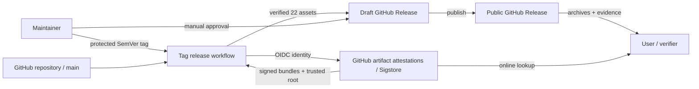
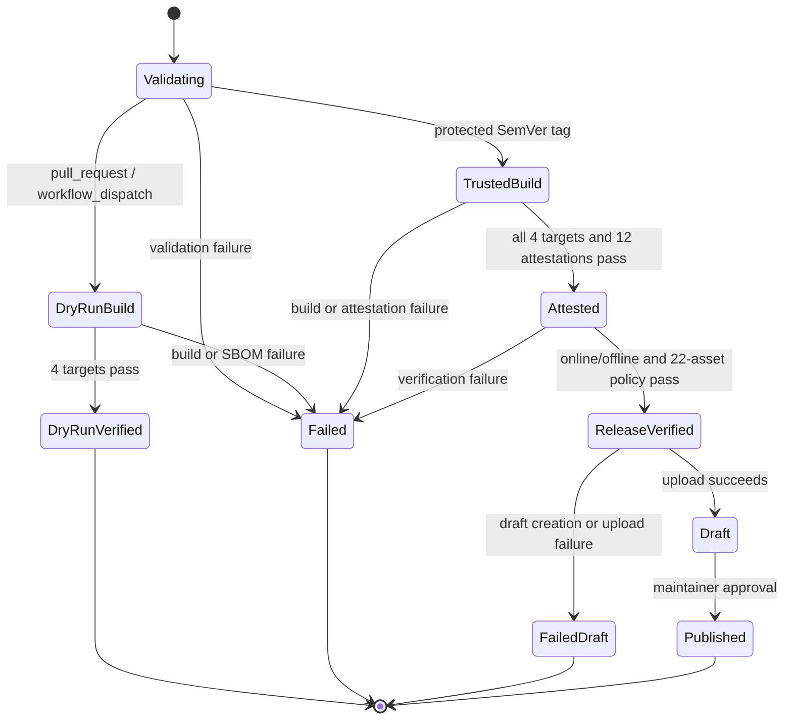

# cppseed リリース・サプライチェーン外部設計書

- 文書バージョン: 0.1
- 対象Gate: G3
- ステータス: In review
- 文書オーナー: `harutasti`
- 技術レビュー: Pending
- テスト可能性レビュー: Pending
- セキュリティレビュー: Pending
- リリース承認: Not applicable at G3
- 対象Issue: [#11](https://github.com/harutasti/cppseed/issues/11)
- Review PR: [#21](https://github.com/harutasti/cppseed/pull/21)
- 上位要件: [リリース・サプライチェーン要件定義書](requirements.md)
- 技術検証: [G2技術検証結果報告書](feasibility-report.md)
- 作成日: 2026-07-16

## 1. Design objective

本書は、cppseedの次回以降の正式リリースについて、利用者とリリース担当者から見える
成果物、検証操作、workflow状態、権限境界および失敗時の振る舞いを定義する。

設計の中心は、各配布アーカイブを同じSHA-256 digestによって次の情報へ結び付けることである。

1. `SHA256SUMS`
2. SPDX 2.3 SBOM
3. SLSA build provenance attestation
4. SBOM attestation
5. allowlist方式のbuild metadata attestation
6. online/offline verificationに使うSigstore bundle

本書は公開contractを定義し、script、function、step名などの実装詳細はG5内部設計で定める。
cppseed CLIのコマンド、終了コードおよび生成プロジェクトの仕様は変更しない。

## 2. System context

### 2.1 Actor and boundary

| Actor/component | Responsibility | Trust |
|---|---|---|
| 利用者 | Release assetを取得し、checksum、attestation、SBOMを検証する | repository外部 |
| Maintainer | mainへmergeし、保護されたSemVer tagを作成し、draft Releaseを確認・公開する | 信頼された運用者 |
| Pull request workflow | 署名なしで4platformのpackage、SBOM、metadata、asset構成を検証する | 未信頼入力を処理するread-only境界 |
| Tag release workflow | main上のtagからbuild、attestation、公開前検証、draft作成を行う | 信頼されたbuild境界 |
| GitHub OIDC / Sigstore | 短命certificate、署名、transparency log、trusted rootを提供する | 外部の署名基盤 |
| GitHub Release | 検証済みassetを長期配布する | 公開配布境界 |

### 2.2 Context flow



### 2.3 Assumption and precondition

- repositoryはpublicであり、GitHub public-good Sigstore instanceを使用できる
- main branchと `v*.*.*` tagはrulesetで保護され、任意の未review commitを正式tagにしない
- 正式tagは `^v[0-9]+\.[0-9]+\.[0-9]+$` に一致するannotated tagである
- tagが指すcommitはmainの履歴上にあり、そのcommitのrequired CIが成功している
- GitHub-hosted runnerだけを使用し、self-hosted runnerを正式buildに使用しない
- GitHub artifact attestations、SigstoreまたはGitHub Releaseの重大障害中は公開を延期する

## 3. Public contract

### ED-SC-001: 適用範囲とrelease identity

- Related requirements: `FR-SC-001`、`FR-SC-014`、`SR-SC-002`
- Inputs: 保護されたSemVer annotated tag、tag commit、repository内のrelease notes
- Outputs: tagと同じversionを持つdraft GitHub Release
- Errors: tag形式、CMake version、release notes、main ancestry、repository visibility、CIの不一致
- Compatibility: 公開済みv0.1.0を変更せず、本設計実装後に作る新しいversionへ適用する

version `X.Y.Z` は、tag `vX.Y.Z`、CMake project version、`cppseed --version`、archive名、
SBOM、build metadataおよびRelease titleで一致しなければならない。Release notesにはtagが指す
40文字のsource commit SHAを記録し、利用者がverification時に固定できるようにする。

### ED-SC-002: 対象archiveと一意なbase name

- Related requirements: `FR-SC-001`、`FR-SC-002`、`FR-SC-009`
- Inputs: version、target、platform別Release build
- Outputs: 4個の最終配布archive
- Errors: 未定義target、拡張子違い、archive内容違い、version違い
- Compatibility: v0.1.0のtarget名とarchive形式を維持する

`<ARCHIVE>` は次のいずれかとし、以後の関連assetはこの完全なarchive名をprefixとして使う。

| Target | Runner | Archive |
|---|---|---|
| `aarch64-apple-darwin` | `macos-15` | `cppseed-v<VERSION>-aarch64-apple-darwin.tar.gz` |
| `x86_64-apple-darwin` | `macos-15-intel` | `cppseed-v<VERSION>-x86_64-apple-darwin.tar.gz` |
| `x86_64-unknown-linux-gnu` | `ubuntu-22.04` | `cppseed-v<VERSION>-x86_64-unknown-linux-gnu.tar.gz` |
| `x86_64-pc-windows-msvc` | `windows-2025` | `cppseed-v<VERSION>-x86_64-pc-windows-msvc.zip` |

archive作成後は内容、名前、permission、timestamp、圧縮形式を変更しない。変更が必要な場合は、
archive作成からSBOM、metadata、attestationおよび全検証をやり直す。

### ED-SC-003: Release asset setと命名

- Related requirements: `FR-SC-004`、`FR-SC-008`、`FR-SC-009`、`FR-SC-013`
- Inputs: 4個の最終archiveと各buildのevidence
- Outputs: 合計22個のGitHub Release assets
- Errors: 不足、余分な対象asset、重複、version/target不一致
- Compatibility: GitHubが自動生成するsource code zip/tar.gzは対象asset数に含めない

各 `<ARCHIVE>` に対し、次の5 assetを公開する。

| Kind | Count | Naming | Purpose |
|---|---:|---|---|
| 配布archive | 4 | `<ARCHIVE>` | 実行ファイル、LICENSE、READMEの配布 |
| SPDX SBOM | 4 | `<ARCHIVE>.spdx.json` | archiveと内包物の機械可読な構成情報 |
| Build metadata | 4 | `<ARCHIVE>.build-metadata.json` | build入力、runner、toolchainのallowlist記録 |
| Dependency report | 4 | `<ARCHIVE>.dependencies.txt` | `ldd`、`otool -L`、`dumpbin /dependents` のplatform別結果 |
| Offline bundle | 4 | `<ARCHIVE>.attestations.jsonl` | provenance、SBOM、metadataの3署名bundle |

Release全体に次の2 assetを公開する。

| Kind | Count | Naming | Purpose |
|---|---:|---|---|
| Trusted root snapshot | 1 | `cppseed-v<VERSION>-trusted-root.jsonl` | offline signature verification |
| Checksums | 1 | `SHA256SUMS` | 上記21 assetのdownload後の同一性確認 |

Release作成前に期待する22 filenameを固定リストとして比較する。prefixやglobだけで個数を
確認せず、別versionや未知targetの混入を失敗させる。

### ED-SC-004: SHA256SUMS contract

- Related requirements: `FR-SC-001`、`FR-SC-005`、`FR-SC-010`
- Inputs: `SHA256SUMS` 自身を除く検証済み21 assets
- Outputs: UTF-8、LF終端の `SHA256SUMS`
- Errors: digest不一致、行数違い、重複、絶対path、未定義filename
- Compatibility: archiveだけを掲載するv0.1.0の形式を拡張し、行形式は維持する

各行は次の形式とする。

```text
<64文字の小文字SHA-256>  <Release asset filename>
```

- filenameのbyte順（`LC_ALL=C`）で昇順に並べる
- digestとfilenameの区切りは空白2個とする
- path separatorやdirectory componentを含めない
- `SHA256SUMS` 自身とGitHub自動生成source archiveを含めない
- 21行すべてを作成直後とdraft upload直前に再検証する

archiveの行に記録されたSHA-256は、SPDX内archive file、3 attestationのsubjectおよび
build metadataの `artifact.sha256` と一致しなければならない。

### ED-SC-005: SPDX 2.3 SBOM contract

- Related requirements: `FR-SC-002`、`FR-SC-003`、`FR-SC-004`、`FR-SC-005`、
  `NFR-SC-001`、`NFR-SC-002`、`NFR-SC-003`、`NFR-SC-005`
- Inputs: 最終archive、archive作成時のstaging directory、target、dependency report
- Outputs: archiveごとのUTF-8 SPDX 2.3 JSON
- Errors: schema/semantic validation error、必須field不足、digest/target/content不一致
- Compatibility: SPDX versionを変更する場合は新しい設計baselineとmigration説明を必要とする

G2で成立確認した次の組合せをG3 baselineとする。

| Item | Baseline |
|---|---|
| Specification | SPDX 2.3 JSON (`SPDX-2.3`) |
| Generation | Syft 1.46.0でstaging directoryをscanし、制御された変換を加える |
| Validation | SPDX Tools 0.8.5のparser、model validation、JSON schema validation |
| Tool acquisition | versionと配布物SHA-256、またはdependency lock内の全hashを固定する |

各SBOMは最低限、次のdata modelを持つ。

| Entity/field | Contract |
|---|---|
| Document | `spdxVersion=SPDX-2.3`、`dataLicense=CC0-1.0`、SPDXID、creator、created、tool version |
| Namespace | `https://github.com/harutasti/cppseed/sbom/v<VERSION>/<TARGET>/<ARCHIVE_SHA256>/<RUN_ID>-<RUN_ATTEMPT>` |
| Package | name `cppseed`、version、supplier、MIT、`APPLICATION`、`filesAnalyzed=true` |
| Archive File | `<ARCHIVE>`、type `ARCHIVE`、SHA-1とSHA-256、license/copyright |
| Content Files | `cppseed` または `cppseed.exe`、`LICENSE`、`README.md`、各SHA-1/SHA-256 |
| Relationships | document `DESCRIBES` package、package `CONTAINS` archive、archive `CONTAINS` 3 content files |
| Target | documentまたはpackageのcommentへtargetとarchive名を構造が安定する形で記録 |
| Dependencies | Syftが検出したpackage/relationshipと、対応dependency report filenameおよび検出限界 |

`packageVerificationCode` はSPDX 2.3のalgorithmに従い、対象File集合と除外集合を内部設計で
一意に定める。SBOM scannerがsystem libraryを完全列挙できないため、検出結果が空でも
「runtime dependencyなし」と主張しない。platform dependency reportを補助証跡とし、
SBOM commentにそのfilenameと限界を記録する。

変換処理は未知fieldを無条件に削除せず、同じ入力ではcreated時刻、namespaceなどの許容fieldを
除いてentityとrelationshipが安定することをG7で検証する。

### ED-SC-006: Build metadata contract

- Related requirements: `FR-SC-007`、`FR-SC-009`、`FR-SC-010`、`SR-SC-005`、
  `NFR-SC-002`
- Inputs: trusted buildの明示的allowlist値
- Outputs: archiveごとのUTF-8 JSON object
- Errors: schema違反、必須field不足、archive/SBOMとの不一致、禁止情報の混入
- Compatibility: `schemaVersion` のmajor変更はpredicate typeのversion更新を伴う

top-level contractは次のとおりとする。配列とobject keyの出力順は内部設計で固定し、
semantic comparisonではJSON objectのkey順と空白を無視する。

```json
{
  "schemaVersion": 1,
  "artifact": {
    "name": "cppseed-v<VERSION>-<TARGET>.<EXT>",
    "version": "<VERSION>",
    "target": "<TARGET>",
    "format": "tar.gz|zip",
    "sha256": "<64 lowercase hex>",
    "createdAt": "<UTC RFC 3339>"
  },
  "source": {
    "repository": "harutasti/cppseed",
    "repositoryUrl": "https://github.com/harutasti/cppseed",
    "commit": "<40 lowercase hex>",
    "ref": "refs/tags/v<VERSION>"
  },
  "workflow": {
    "path": ".github/workflows/release.yml",
    "ref": "refs/tags/v<VERSION>",
    "runId": "<decimal string>",
    "runAttempt": "<decimal string>",
    "runUrl": "https://github.com/harutasti/cppseed/actions/runs/<RUN_ID>"
  },
  "runner": {
    "provider": "GitHub-hosted",
    "os": "<OS>",
    "architecture": "<ARCH>",
    "imageOS": "<IMAGE_OS>",
    "imageVersion": "<IMAGE_VERSION>",
    "kernel": "<KERNEL_OR_WINDOWS_BUILD>"
  },
  "build": {
    "configuration": "Release",
    "compiler": {"name": "<NAME>", "version": "<VERSION>"},
    "cmake": {"version": "<VERSION>", "generator": "<GENERATOR>"},
    "options": ["<NAME>=<VALUE>"]
  },
  "tools": {
    "syft": "1.46.0",
    "spdxTools": "0.8.5",
    "actionsAttest": "4.1.1",
    "gh": "2.96.0"
  },
  "evidence": {
    "sbom": {
      "name": "<ARCHIVE>.spdx.json",
      "sha256": "<64 lowercase hex>"
    },
    "dependencyReport": {
      "name": "<ARCHIVE>.dependencies.txt",
      "sha256": "<64 lowercase hex>",
      "method": "ldd|otool -L|dumpbin /dependents"
    }
  }
}
```

metadataへ記録できる環境値は上記fieldだけとする。token、secret、署名鍵、email、任意の
environment dump、workspace/homeの絶対path、command lineのcredentialを含めない。
releaseへ影響するCMake optionsはkey順に並べ、secretになり得る任意inputを転記しない。

### ED-SC-007: Attestation and bundle contract

- Related requirements: `FR-SC-006`、`FR-SC-007`、`FR-SC-008`、`FR-SC-009`、
  `SR-SC-003`、`SR-SC-004`、`NFR-SC-001`
- Inputs: 変更されない最終archive、SPDX、build metadata、GitHub OIDC identity
- Outputs: archiveごとの3 attestationと1 offline JSONL bundle
- Errors: subject/predicate違い、署名/API/transparency log失敗、bundle個数違い
- Compatibility: predicate type変更時はverification commandとRelease notesを同時更新する

各archiveを同一subjectとして次の3 attestationを発行する。

| Order | Claim | Predicate type | Predicate source |
|---:|---|---|---|
| 1 | Build provenance | `https://slsa.dev/provenance/v1` | `actions/attest` がGitHub contextから生成 |
| 2 | SBOM | `https://spdx.dev/Document/v2.3` | Release assetのSPDX JSONと意味的に同一 |
| 3 | Build metadata | `https://github.com/harutasti/cppseed/attestations/build-metadata/v1` | Release assetのbuild metadataと意味的に同一 |

すべてのin-toto statementはsubject nameを `<ARCHIVE>`、subject digestをarchiveのSHA-256とする。
SBOMまたはmetadata asset自体をsubjectにする方式は採用しない。archiveを共通subjectにし、
署名済みpredicateと公開JSONを正規化比較することで対応を検証する。

`actions/attest` はv4.1.1のreview済み完全commit SHA
`a1948c3f048ba23858d222213b7c278aabede763` へ固定する。各stepの `bundle-path` を
JSON object 1行へcompact化し、上表の順で3行を連結して
`<ARCHIVE>.attestations.jsonl` とする。bundleはGitHub APIへ接続しなくても検証できる
署名、certificate、transparency log material、statementを保持する。

### ED-SC-008: Online verification contract

- Related requirements: `FR-SC-006`、`FR-SC-008`、`FR-SC-010`、`FR-SC-012`
- Inputs: archive、expected repository/workflow/tag/commit/predicate、GitHub network access
- Outputs: 検証済みstatementまたはnon-zero exit
- Errors: digest、signature、identity、source、workflow、predicate、runner制約の不一致
- Compatibility: GitHub CLI 2.96.0以上をverification baselineとする

READMEと各Release notesは、少なくとも次の制約をすべて付けたコピー可能なcommandを示す。

```bash
REPOSITORY=harutasti/cppseed
VERSION=<VERSION>
SOURCE_SHA=<40文字のtag commit SHA>
ARCHIVE=cppseed-v${VERSION}-<TARGET>.<EXT>
WORKFLOW=harutasti/cppseed/.github/workflows/release.yml

gh attestation verify "$ARCHIVE" \
  --repo "$REPOSITORY" \
  --signer-workflow "$WORKFLOW" \
  --signer-digest "$SOURCE_SHA" \
  --source-ref "refs/tags/v$VERSION" \
  --source-digest "$SOURCE_SHA" \
  --predicate-type https://slsa.dev/provenance/v1 \
  --deny-self-hosted-runners
```

同じidentity制約でpredicate typeを `https://spdx.dev/Document/v2.3` とcustom metadata typeへ
切り替え、3種類を個別に検証する。SBOM/metadataは `--format json` のstatementからpredicateを
取得し、Release asset JSONとobject key順・空白を無視して意味的に一致することを確認する。

repositoryだけを指定した既定verificationを正式な検証手順とみなさない。source digestと
workflowまで固定することで、別branch、別workflowまたは過去のorphan attestationを除外する。

### ED-SC-009: Offline verification and trusted root contract

- Related requirements: `FR-SC-002`、`FR-SC-009`、`FR-SC-010`、`FR-SC-012`、
  `FR-SC-013`
- Inputs: archive、archive別bundle、release全体のtrusted root、expected identity/source/predicate
- Outputs: network accessなしの検証結果
- Errors: bundle/root不足、期限・署名・transparency material・identity・digestの不一致
- Compatibility: root format変更時はGitHub CLI互換性を確認し、旧Release assetを差し替えない

trusted rootは全attestation発行後、公開前検証と同じworkflow runで
`gh attestation trusted-root` から1回取得する。4platformで共用し、versionを含むfilenameで
Releaseへ保存する。archive別JSONL bundleにはED-SC-007の3 bundleだけを含める。

offline commandはonline commandと同じpolicyを維持し、local materialを明示する。

```bash
BUNDLE="$ARCHIVE.attestations.jsonl"
ROOT="cppseed-v${VERSION}-trusted-root.jsonl"

env -u GH_TOKEN -u GITHUB_TOKEN \
  gh attestation verify "$ARCHIVE" \
    --repo "$REPOSITORY" \
    --bundle "$BUNDLE" \
    --custom-trusted-root "$ROOT" \
    --signer-workflow "$WORKFLOW" \
    --signer-digest "$SOURCE_SHA" \
    --source-ref "refs/tags/v$VERSION" \
    --source-digest "$SOURCE_SHA" \
    --predicate-type https://slsa.dev/provenance/v1 \
    --deny-self-hosted-runners
```

公開前testでは、tokenを除去しnetworkを通信不能にした状態で3 predicateすべてを検証する。
Release同梱rootは当該release時点のhistorical snapshotであり、将来のrevocation情報やtrust
更新を自動取得するものではない。高保証用途では、online verificationまたは最新trusted rootと
security advisoryも確認するよう利用者へ説明する。root更新、失効、incident時の判断はG6と
G10で手順化する。

### ED-SC-010: Workflow event and permission boundary

- Related requirements: `FR-SC-010`、`FR-SC-011`、`SR-SC-001`、`SR-SC-002`、
  `SR-SC-003`、`SR-SC-005`
- Inputs: pull request、workflow_dispatch dry run、保護SemVer tag
- Outputs: eventに応じたread-only検証、またはattested draft Release
- Errors: event/ref/permission条件違反、外部service failure
- Compatibility: 既存3 triggerを維持し、trusted jobだけをtagへ限定する

job-level permissionsを条件分岐で兼用せず、read-only job、attestation job、draft作成jobを
分離する。workflow全体は `contents: read` を既定とし、`pull_request_target` は使用しない。

| Logical job | Event | Permissions | External effect |
|---|---|---|---|
| `validate` | PR / dispatch / tag | `contents: read` | なし |
| `dry-run-package` matrix | PR / dispatch | `contents: read` | 署名なしActions artifactのみ |
| `dry-run-aggregate` | PR / dispatch | `contents: read` | asset名、個数、SBOM、metadata、digestを検証 |
| `release-build-attest` matrix | protected tag only | `contents: read`, `id-token: write`, `attestations: write`, `artifact-metadata: write` | 3 attestation/targetを発行 |
| `release-verify` | protected tag only | `contents: read` | online/offline検証、trusted root取得、verified artifact作成 |
| `create-draft-release` | protected tag only | `contents: write` | draft Releaseを作成、22 assetをupload |

attestation jobはcheckout、build、test、archive作成、SBOM、metadata、3 attestationまでを同じ
GitHub-hosted runner jobで完結させる。job間で受け渡すarchiveは、受取側がbundleのsubject
digestと `SHA256SUMS` を再検証してから公開対象とする。

PRとdispatch dry runでは、attestation発行、OIDC token要求、trusted root取得、Release作成を
行わない。fork PRのcodeがwrite permissionやsecretへ到達できない構造を維持する。

### ED-SC-011: Public workflow and release state transition

- Related requirements: `FR-SC-010`、`FR-SC-011`、`SR-SC-004`、`NFR-SC-004`
- Inputs: event、全matrix結果、検証結果、maintainer approval
- Outputs: dry-run evidence、draft Release、またはpublic Release
- Errors: 任意のbuild/test/validation/verification/upload failure
- Compatibility: public化は既存どおりmaintainerの手動操作とする



`create-draft-release` は4 targetのattestationとrelease-wide verificationがすべて成功した場合
だけ開始する。GitHub Releaseのpublic化はworkflowで自動実行せず、maintainerがdraftのasset、
Release notes、run URL、source commitおよび未解決riskを確認してから行う。

追加処理の通常目標は合計10分以内とする。matrix buildの所要時間と、SBOM/attestation/
verificationによる追加時間を分けてjob summaryへ記録する。

### ED-SC-012: Pre-publication verification contract

- Related requirements: `FR-SC-010`、`SR-SC-004`、`SR-SC-005`
- Inputs: tag jobが生成した全assetとattestation service上のstatement
- Outputs: 1つのverified release asset set
- Errors: 下記checkの1件以上の失敗
- Compatibility: check削除は要件・設計baselineの変更を必要とする

draft作成前に最低限、次を自動検証する。

1. exact filename setが22 asset contractと一致する
2. 4 archiveの展開内容、実行権限、version、help、生成project smoke testが成功する
3. 各SPDXがschema/model validationを通り、version、target、4 File、relationshipが一致する
4. 各archiveのSHA-256がSPDX、metadata、`SHA256SUMS`、3 subjectで一致する
5. 各metadataがschemaとallowlistに一致し、禁止patternや絶対workspace pathを含まない
6. dependency reportが存在し、未解決または許可していないdynamic dependencyを含まない
7. 12 online verificationがrepository、workflow path/digest、tag、source commit、runner、
   predicate制約付きで成功する
8. 4 SBOM predicateと4 metadata predicateが対応するRelease JSONと意味的に一致する
9. 12 offline verificationがnetwork/tokenなし、bundleとtrusted rootだけで成功する
10. bundleがtargetごとにexactly 3 JSON linesを持ち、未知predicateを含まない
11. `SHA256SUMS` がexactly 21行で全対象assetを再検証できる
12. upload直前のfile digestが上記検証時から変化していない

job summaryにはtarget別Pass/Fail、archive digest、attestation URL/ID、tool version、経過時間を
出力する。secret、token、local absolute pathはsummaryへ出力しない。

### ED-SC-013: Failure, retry, and idempotency

- Related requirements: `FR-SC-010`、`FR-SC-012`、`SR-SC-004`
- Inputs: 各workflow stateのfailureまたはrerun要求
- Outputs: fail-closed停止、診断情報、明示的なrecovery path
- Errors: 同名Release、部分upload、外部service outage、orphan attestation
- Compatibility: 公開済みversionを上書きしない既存方針を維持する

| Failure | Detection | Impact/recovery | Release blocking |
|---|---|---|---|
| build/test/SBOM/metadata失敗 | matrix job non-zero | 原因修正後、新しいcommit/tagで再実行 | Yes |
| 一部attestation発行失敗 | 発行数、ID、bundle不足 | 発行済みstatementは削除せずorphan evidenceとして残る。Releaseは作らない | Yes |
| online service outage | API、OIDC、Sigstore、TUF failure | service回復後にrerun。検証をskipしない | Yes |
| online/offline policy不一致 | `gh attestation verify` non-zeroまたはJSON比較失敗 | artifactを公開せず、source/tool/identity差異を調査 | Yes |
| checksum/asset違い | exact setまたはdigest check failure | aggregationから再生成し、再attestが必要ならbuildからやり直す | Yes |
| draft作成前の失敗 | `create-draft-release` 未到達 | publicなReleaseは存在しない。安全にrerun可能 | Yes |
| draft作成・uploadの部分失敗 | draftまたはasset数をAPIで確認 | incomplete draftを削除してから同じ未公開tagをrerun | Yes |
| 公開後の問題 | post-release verificationまたは報告 | asset差し替え禁止。Releaseを明示撤回し、新patch versionで修正 | Yes for further use |

同じtagのrerunで複数attestationが存在しても、archive digest、source ref/digest、signer workflow、
predicate typeをすべて満たすstatementだけを採用する。異なるdigestのorphan attestationは
当該archiveを検証できない。draftが既に存在する場合は自動上書きせず停止する。

### ED-SC-014: User communication, retention, and reproducibility boundary

- Related requirements: `FR-SC-012`、`FR-SC-013`、`FR-SC-014`、`NFR-SC-004`、
  `NFR-SC-005`
- Inputs: verified Release asset、verification command、known limitations
- Outputs: README、Release notes、security reporting path、長期evidence
- Errors: command不足、source/tool version不明、誤ったreproducibility表現
- Compatibility: 公開済みRelease notesのhistorical factを後続仕様へ書き換えない

READMEとRelease notesは次を含む。

- archiveと対応する4 assetの選び方
- macOS/Linux/WindowsでのSHA-256確認方法
- ED-SC-008とED-SC-009のonline/offline command
- 3 predicateの意味と、SBOM/metadata assetのsemantic comparison方法
- verification失敗時は実行を中止し、通常Issueまたは`SECURITY.md`のprivate reportingへ連絡する手順
- code signing/notarization未対応、system dependency検出限界、対応OS/ABI
- provenanceは「どこで何からbuildしたか」の証拠であり、bit-for-bit再現可能性の保証ではないこと

checksum確認例はplatform別に次の操作を示す。

```bash
# Linux
sha256sum --check SHA256SUMS

# macOS
shasum -a 256 --check SHA256SUMS
```

```powershell
# Windows PowerShell: 1 assetの例。期待値はSHA256SUMSの該当行を使用する。
$actual = (Get-FileHash -Algorithm SHA256 $Archive).Hash.ToLowerInvariant()
if ($actual -ne $ExpectedSha256) { throw 'SHA-256 verification failed' }
```

`SHA256SUMS` はdownload errorや偶発的変更を検出するが、それ自体は署名ではない。archiveの
真正性はattestation verificationで確認し、offline trusted rootの安全な初回取得はG6 threat
modelとG10 runbookで扱う。

Release asset、tag、Release notes、attestation service上のstatement、transparency log、workflow run、
repository内のtest/acceptance reportを長期証跡とする。期限付きActions artifactだけに依存しない。
公開済みassetを更新せず、将来toolやrootが変わってもrelease時点のbundle/rootを保持する。

## 4. Workflow and state transition

### 4.1 PR / manual dry run

1. `validate` がversion、source、変更対象を確認する
2. 4platformのread-only matrixがbuild、test、package、SBOM、metadata、dependency reportを生成する
3. aggregatorが期待する16 files（4 archive、4 SBOM、4 metadata、4 dependency report）を
   exact setで確認し、digestとschemaを検証する
4. release作成、attestation、trusted root取得を行わず終了する

注: dry runの生成対象は4種類×4targetの16 filesである。G5ではこの値をconstantとして1か所に
定義し、説明文とtestがずれないようにする。

### 4.2 Protected tag release

1. `validate` がannotated tag、SemVer、main ancestry、required CI、public repositoryを確認する
2. trusted matrixが4platformをbuildし、targetごとにarchive、SBOM、metadata、dependency reportと
   3 attestationを生成する
3. release verifierが4targetのoutputを取得し、3 bundleをtarget別JSONLへまとめ、trusted rootを取得する
4. exact asset set、checksum、SPDX、metadata、online/offline attestationをfail-closedで検証する
5. 検証済み21 filesから `SHA256SUMS` を作成・再検証して22 filesを確定する
6. write権限を持つjobがdraft Releaseを作り、同一filesをuploadする
7. maintainerがdraftと証跡を確認し、手動でpublic化する

### 4.3 Ordering invariant

```text
archive immutable
  -> SBOM / metadata
  -> provenance / SBOM / metadata attestations
  -> target bundle aggregation
  -> online + offline policy verification
  -> SHA256SUMS for all non-self assets
  -> draft upload
  -> manual publish
```

矢印を逆転またはskipしてはならない。archiveを変更した場合は先頭へ戻る。

## 5. Data and artifact formats

| Artifact | Format/schema | Naming | Retention | Integrity |
|---|---|---|---|---|
| Distribution archive | tar.gz / zip | ED-SC-002 | Release lifetime | SHA-256、3 attestation subject |
| SPDX SBOM | SPDX 2.3 JSON、UTF-8 | `<ARCHIVE>.spdx.json` | Release lifetime | checksum、schema、SBOM predicate比較 |
| Build metadata | schemaVersion 1 JSON、UTF-8 | `<ARCHIVE>.build-metadata.json` | Release lifetime | checksum、custom predicate比較 |
| Dependency report | UTF-8 text、LF | `<ARCHIVE>.dependencies.txt` | Release lifetime | checksum、metadata参照 |
| Attestation bundle | Sigstore bundle JSONL、3 lines | `<ARCHIVE>.attestations.jsonl` | Release lifetime | checksum、signature、identity policy |
| Trusted root | GitHub CLI trusted root JSONL | `cppseed-v<VERSION>-trusted-root.jsonl` | Release lifetime | checksum、offline policy |
| Checksums | GNU-style SHA-256 text、21 lines | `SHA256SUMS` | Release lifetime | 全行再計算 |

各JSONはUTF-8、末尾LF、秘密情報なしとする。comparison用のJSON canonicalization方法はG5で
固定し、署名対象predicateそのものは生成後に書き換えない。

## 6. Permission and trust boundary

| Component/job | Read | Write | Identity/secret | Justification |
|---|---|---|---|---|
| Workflow default / validate | repository contents | なし | default token、`contents: read` | source検証だけを行う |
| PR/dispatch dry run | repository contents | なし | OIDCなし、secretなし | forkを含む未信頼codeを処理する |
| Trusted build/attest | repository contents | attestation API、artifact metadata | GitHub OIDC、short-lived certificate | archiveとstatementを同じtrusted jobで生成する |
| Release verifier | repository、job artifact、attestation API/TUF | なし | `contents: read` tokenのみ | 公開前policyをread-onlyで判定する |
| Draft creator | repository、verified asset | draft Releaseだけ | `contents: write` token | 全検証後に限定して配布面へ書く |
| Maintainer | draft、run、risk record | publish / withdraw | GitHub account + repository control | 最終release判断を人が行う |

Actionは完全commit SHAへ固定し、隣接コメントへversionを記録する。Syft binary、Python wheel、
GitHub CLIなど取得可能なtoolはversionとhashを固定し、target環境に対応したlockをCIで監査する。

## 7. Failure behavior

全failureはED-SC-013に従いfail-closedとする。次をrelease blockerとして明示する。

- required asset、attestation、predicate、identity constraintの不足
- checksum、SPDX、metadata間のarchive digest不一致
- offline verificationだけ、またはonline verificationだけの失敗
- trusted root取得失敗または古いrootを無断で流用した状態
- unknown system dependency、secret/path leak、未review Action/tool更新
- required CI未成功、main外commit、lightweight tag、未保護tag

外部service障害はverification免除の理由にしない。公開延期として扱う。

## 8. Compatibility and migration

- v0.1.0のRelease、asset、checksum、tag、Release notesは変更しない
- 本設計の初回適用versionはG11 acceptance時に確定し、Release notesへ明記する
- archive名、target、archive内の3 filesは既存contractを維持する
- 新規SBOM等は追加assetであり、cppseed CLIのruntime dependencyを増やさない
- 利用者は従来どおりarchiveとchecksumだけでも同一性確認できるが、真正性確認にはattestationを推奨する
- SPDX、predicate type、metadata schemaの破壊的変更は新しいdocument version、ADR、test、利用者手順を必要とする
- GitHub CLI 2.96.0をbaselineとし、G8で実測した最低versionをREADMEとRelease notesへ固定する

## 9. Requirement coverage

| Requirement | External design | Notes |
|---|---|---|
| `FR-SC-001` | `ED-SC-001`、`ED-SC-002`、`ED-SC-004` | filenameと同一SHA-256で識別 |
| `FR-SC-002` | `ED-SC-002`、`ED-SC-005` | 1 archive 1 SBOM |
| `FR-SC-003` | `ED-SC-005` | SPDX 2.3、Syft 1.46.0、SPDX Tools 0.8.5 |
| `FR-SC-004` | `ED-SC-003`、`ED-SC-005` | archive/content/dependency境界を固定 |
| `FR-SC-005` | `ED-SC-002`、`ED-SC-005`、`ED-SC-011` | archive後変更禁止とordering invariant |
| `FR-SC-006` | `ED-SC-007`、`ED-SC-008` | SLSA provenanceをarchive subjectで発行 |
| `FR-SC-007` | `ED-SC-006`、`ED-SC-007` | allowlist metadataをcustom predicateで署名 |
| `FR-SC-008` | `ED-SC-005`、`ED-SC-007`、`ED-SC-012` | SPDX assetとpredicateのsemantic equality |
| `FR-SC-009` | `ED-SC-003`、`ED-SC-007`、`ED-SC-009` | exact 22 assets |
| `FR-SC-010` | `ED-SC-010`、`ED-SC-011`、`ED-SC-012`、`ED-SC-013` | draft前のfail-closed検証 |
| `FR-SC-011` | `ED-SC-010`、`ED-SC-011` | PR/dispatchとtrusted tag jobを分離 |
| `FR-SC-012` | `ED-SC-008`、`ED-SC-009`、`ED-SC-014` | copy可能なonline/offline手順 |
| `FR-SC-013` | `ED-SC-003`、`ED-SC-009`、`ED-SC-014` | Releaseとattestation serviceへ長期保持 |
| `FR-SC-014` | `ED-SC-001`、`ED-SC-014` | v0.1.0不変 |
| `SR-SC-001` | `ED-SC-010`、Section 6 | job単位の最小権限 |
| `SR-SC-002` | `ED-SC-001`、`ED-SC-010` | protected tag、main ancestry、GitHub-hosted runner |
| `SR-SC-003` | `ED-SC-005`、`ED-SC-007`、Section 6 | Action SHAとtool/hash固定 |
| `SR-SC-004` | `ED-SC-002`、`ED-SC-011`、`ED-SC-012` | attest後のarchive不変性 |
| `SR-SC-005` | `ED-SC-006`、`ED-SC-010`、Section 6 | allowlistとsecret禁止 |
| `NFR-SC-001` | `ED-SC-005`、`ED-SC-007` | SPDX、SLSA/in-toto、Sigstore |
| `NFR-SC-002` | `ED-SC-005`、`ED-SC-006` | UTF-8 JSON |
| `NFR-SC-003` | `ED-SC-005` | 許容field以外の安定性 |
| `NFR-SC-004` | `ED-SC-011`、`ED-SC-014` | 追加10分目標と計測 |
| `NFR-SC-005` | `ED-SC-005`、`ED-SC-007`、Section 8 | versionと変更時impactを明記 |

## 10. Decision disposition and residual risk

| ID | G3 selection | Rationale / downstream action |
|---|---|---|
| `DEC-SC-001` | SPDX 2.3、Syft 1.46.0、SPDX Tools 0.8.5 | G2実測済み。G4 ADRで代替案と更新条件を承認する |
| `DEC-SC-002` | archiveをsubjectとするcustom metadata predicate | asset JSONとのsemantic equalityでdigest、source、build情報を署名へ結び付ける |
| `DEC-SC-003` | target別3-line JSONL bundleとrelease-wide versioned trusted root | offline利用を単純化し、assetとの対応をfilenameで一意化する |
| `RISK-SC-001` | Open | root snapshotの更新/revocation/incidentをG6/G10で扱う |
| `RISK-SC-002` | Control selected | SBOMとplatform dependency reportの役割を分け、完全性を誤表示しない |
| `RISK-SC-003` | Open | SPDX変換のunit、semantic、negative testをG7で設計する |
| `RISK-SC-004` | Control selected | 対象runner/Pythonごとのhash lockとmarker auditをG5/G7へ入れる |

G3では方式をpublic contractとして選択する。選択肢、trade-off、更新条件の正式な判断記録は
G4 ADRで作成するため、ADR承認前に実装へ進まない。

## 11. Reference

- [GitHub Docs: Artifact attestations](https://docs.github.com/en/actions/concepts/security/artifact-attestations)
- [GitHub Docs: Using artifact attestations](https://docs.github.com/en/actions/how-tos/secure-your-work/use-artifact-attestations)
- [GitHub Docs: Verifying attestations offline](https://docs.github.com/en/actions/how-tos/secure-your-work/use-artifact-attestations/verify-attestations-offline)
- [actions/attest v4.1.1](https://github.com/actions/attest/releases/tag/v4.1.1)
- [Syft v1.46.0](https://github.com/anchore/syft/releases/tag/v1.46.0)
- [SPDX Tools v0.8.5](https://github.com/spdx/tools-python/releases/tag/v0.8.5)
- [SPDX 2.3 specification](https://spdx.github.io/spdx-spec/v2.3/)
- [SLSA provenance v1](https://slsa.dev/spec/v1.2/provenance)

## 12. Change history

| Date | Version | Change | PR |
|---|---:|---|---|
| 2026-07-16 | 0.1 | Initial G3 external design candidate | [#21](https://github.com/harutasti/cppseed/pull/21) |

## 13. Approval

個人運営のため、独立した第三者承認ではなく、PR上で観点を分けたself-reviewとして記録する。

| Role | Reviewer | Result | Date | Evidence |
|---|---|---|---|---|
| Technical | `harutasti` | Pending | — | — |
| Testability | `harutasti` | Pending | — | — |
| Security | `harutasti` | Pending | — | — |
| Release | `harutasti` | Not applicable at G3 | 2026-07-16 | [開発プロセス](../../development-process.md) |
