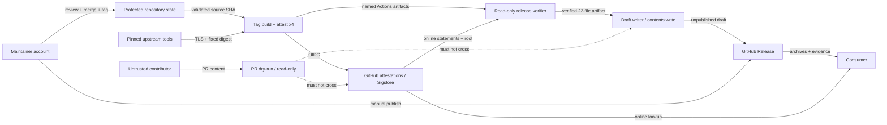

# cppseed リリース・サプライチェーン脅威分析

- 文書バージョン: 0.1
- 対象Gate: G6
- ステータス: In review
- Security owner: `harutasti`
- 技術レビュー: Pending
- テスト可能性レビュー: Pending
- セキュリティレビュー: Pending
- リリース承認: Not applicable at G6
- 対象Issue: [#11](https://github.com/harutasti/cppseed/issues/11)
- 上位設計: [外部設計](external-design.md)、[内部設計](detailed-design.md)
- ADR: [ADR-0001](adr/0001-spdx-2-3-toolchain.md)、
  [ADR-0002](adr/0002-signed-build-metadata-predicate.md)、
  [ADR-0003](adr/0003-offline-bundle-and-trusted-root.md)
- Review PR: [#24](https://github.com/harutasti/cppseed/pull/24)
- 作成日: 2026-07-16

## 1. Security objective

### 1.1 Security goals

cppseedのrelease supply chainは、利用者が取得した配布archiveについて次を判断できる状態を守る。

| Property | Goal |
|---|---|
| Authenticity | `harutasti/cppseed` の期待したworkflowが、期待したtag/source commitからarchiveを生成したと検証できる |
| Integrity | archive、SBOM、metadata、bundle、trusted root、checksumがbuild後・検証後・配布中に置換されていない |
| Authorization | 未信頼PRはread-onlyで、保護tag jobだけがOIDC/attestation、最終jobだけがdraft writeを行う |
| Confidentiality | token、secret、署名材料、個人情報、不要なlocal pathを公開evidenceとlogへ含めない |
| Availability | 外部serviceや検証の異常時は誤ったreleaseを公開せず、診断可能な状態で延期・復旧できる |
| Auditability | source、workflow、review、run、artifact digest、attestation、release判断を後日追跡できる |

署名の目的は「artifactが安全であること」そのものを証明することではなく、artifactとsource、builder、
workflow、predicateを改ざん検知可能な形で結び付けることである。期待したsource/workflow自体が悪意ある
場合、正しいattestationが発行され得るため、repository controlとconsumer policyをtrust chainに含める。

### 1.2 Security non-goals and inherited trust

次は本initiativeだけでは保証しない。

- source codeやdependencyに脆弱性・悪意ある処理がないこと
- bit-for-bit reproducible build
- macOS/Windowsのcode signing、notarization、OS publisher identity（Issue #10）
- GitHub、GitHub-hosted runner、OIDC、artifact attestation service、Sigstore public-good instance、
  transparency log、TUF root配布基盤の完全な無侵害
- maintainer端末・GitHub accountの完全な無侵害
- SBOM scannerによるsystem dependencyの完全列挙
- offline rootをReleaseと同じchannelから初回取得した場合の独立したtrust bootstrap

これらの依存を隠さず、外部service compromise時はsecurity advisoryとrelease撤回、service outage時は
fail-closedな延期、consumerにはonline verificationと既知の限界を案内する。

### 1.3 Assessment method

STRIDE（Spoofing、Tampering、Repudiation、Information disclosure、Denial of service、Elevation of
privilege）を基本に、source/build/distribution/verificationのsupply-chain固有scenarioを追加する。

| Scale | Likelihood | Severity |
|---|---|---|
| Low | 複数のtrusted controlまたはplatform compromiseを必要とする | 限定的な診断・一時的影響 |
| Medium | 現実的な設定誤り、account compromise、外部障害で発生し得る | release延期、限定的な情報漏えい、検証証跡の欠損 |
| High | 未信頼入力だけで繰り返し試行できる、または既知の運用限界として発生する | authenticity/integrityの喪失、secret漏えい、誤release |
| Critical | — | 悪意ある実行物を正規releaseとして受理させる、または署名・trust control全体を迂回する |

severityを優先してrelease blockerを決める。Critical/High residual riskは、明示的なmitigationとG11承認が
ない限り公開できない。文書が脅威を正しく記録したことと、その脅威が実装で解消済みであることを区別する。

## 2. Assets

| Asset ID | Asset | Security property | Impact if compromised |
|---|---|---|---|
| `AS-SC-001` | main source、release workflow、manifest、schema、scripts | integrity、authenticity | 悪意ある処理を正しいworkflowとして署名できる |
| `AS-SC-002` | protected main/tag/ruleset/check state | authorization、integrity | 未review commitまたは偽tagをrelease sourceにできる |
| `AS-SC-003` | 4platform archiveと内包binary | integrity、authenticity | 利用者が改ざん・悪意ある実行物を起動する |
| `AS-SC-004` | SPDX、metadata、dependency report | integrity、confidentiality | 構成・build条件の虚偽、secret/PII漏えい |
| `AS-SC-005` | provenance、SBOM、metadata attestation | authenticity、integrity | 不正artifactまたはpredicateを正当化する |
| `AS-SC-006` | target JSONL bundle、trusted root snapshot | integrity、authenticity | offline verifierが攻撃者のtrust chainを受理する |
| `AS-SC-007` | SHA256SUMS、exact 22-asset set | integrity、completeness | 欠落・置換assetを同一releaseと誤認する |
| `AS-SC-008` | OIDC token、`GITHUB_TOKEN`、maintainer credential | confidentiality、authorization | attestation発行、repository/Release改変、account takeover |
| `AS-SC-009` | Actions artifactとjob間manifest | integrity、freshness | 検証前後または別attemptのartifactを混入する |
| `AS-SC-010` | GitHub Release、tag、notes、public verification command | integrity、availability | 利用者を誤asset・弱いpolicyへ誘導する |
| `AS-SC-011` | workflow log、summary、test/acceptance report、Issue記録 | auditability、confidentiality | incident調査不能、虚偽承認、secret漏えい |
| `AS-SC-012` | pinned Action/tool/dependency identityとdigest | integrity、availability | build/validator/verifier自体が攻撃codeになる |

## 3. Actors and trust boundaries

### 3.1 Actors

| Actor/component | Trust level | Credentials/capability | Boundary crossed |
|---|---|---|---|
| Anonymous consumer | Untrusted | public Release read、local verification | public distribution boundary |
| External contributor/fork PR | Untrusted | source/workflow input proposal、read-only PR run | PR input boundary |
| Maintainer | Privileged human | merge、tag、draft review/publication、settings | account/repository control boundary |
| GitHub repository control plane | Trusted external | refs、rulesets、checks、workflow dispatch | repository/build boundary |
| GitHub-hosted runner | Trusted external, ephemeral | build code execution、job-scoped token | control plane/worker boundary |
| Tag attestation job | Trusted workload | `id-token: write`、`attestations: write` | OIDC/attestation boundary |
| Release verifier job | Trusted read-only workload | artifact/API read、local verification | artifact/verification boundary |
| Draft writer job | Narrow privileged workload | `contents: write` | verification/publication boundary |
| GitHub OIDC/artifact attestation service | Trusted external | certificate/attestation issuance | workload identity boundary |
| Sigstore/TUF/transparency services | Trusted external | root、certificate/log verification material | public trust boundary |
| GitHub Release/Actions artifact storage | Trusted external storage | temporary/permanent artifact distribution | storage boundary |
| Anchore/GitHub/PyPI upstream | Partially trusted | tool/action/package distribution | dependency acquisition boundary |
| Network attacker | Untrusted | traffic interruption/redirect attempt | runner/external network boundary |
| Compromised dependency or maintainer account | Adversarial privileged | valid upstream/repository identity | inherited trust boundary |

### 3.2 Boundary and data flow

| Boundary ID | From -> To | Allowed data/capability | Forbidden crossing |
|---|---|---|---|
| `TB-SC-001` | fork/PR -> dry-run | reviewed checkout、read-only artifact | secret、OIDC、attestation、Release write |
| `TB-SC-002` | maintainer/main -> tag build | protected annotated SemVer tag、successful checks | arbitrary ref、lightweight/unreviewed tag |
| `TB-SC-003` | runner -> upstream | exact HTTPS URL、version、digest | mutable latest URL、credential付きURL、unknown redirect |
| `TB-SC-004` | attestation job -> OIDC/Sigstore | archive subject、3 approved predicates | PR event、self-hosted runner、unknown subject |
| `TB-SC-005` | target job -> verifier | exact artifact name、release/internal separation、manifest digest | glob merge、old attempt、symlink、extra file |
| `TB-SC-006` | verifier -> writer | one verified artifact with exact digest/set | repository source execution、unverified path |
| `TB-SC-007` | Release -> consumer | 22 named assets、notes、copyable strict policy | checksum-only authenticity claim、ambiguous source archive |
| `TB-SC-008` | trusted root source -> offline verifier | release-time snapshot plus limitation | rootを無条件の最新revocation情報とみなすこと |

## 4. Threats

| Threat ID | Category | Scenario | Preconditions | Impact | Likelihood | Severity |
|---|---|---|---|---|---|---|
| `TH-SC-001` | E/T | PRまたはdispatch jobがOIDC/write permissionを得てattestation/Releaseを操作する | event/job permission分離の退行 | 未信頼codeを正規releaseとして署名・公開 | Medium | Critical |
| `TH-SC-002` | E/T | PR title、branch、input等をshellへ直接展開しscript injectionする | untrusted contextの式展開 | runner command改変、将来のprivileged path侵害 | High | High |
| `TH-SC-003` | S/T | 攻撃者がlightweight tag、未保護tag、main外commitを正式tagとして起動する | tag rulesetまたはsource validation不足 | 未review sourceの正規attestation/draft | Medium | Critical |
| `TH-SC-004` | S/T | required checkを省略、古い結果、同名別appで偽装する | ruleset/check API検証不足 | test不合格commitをrelease | Medium | High |
| `TH-SC-005` | S/E | maintainer account、PAT、session、端末が奪取される | phishing/malware/credential漏えい | settings、merge、tag、draft/public Releaseの支配 | Low | Critical |
| `TH-SC-006` | T | main上のworkflow/manifest/schema自体へ悪意ある変更をmergeする | repository control/review失敗 | 悪意あるbuildを期待workflowとして正しく署名 | Low | Critical |
| `TH-SC-007` | T | mutable Action tagまたはreviewしていないAction commitを実行する | pin/update policy退行 | token/OIDC/artifactの窃取・改ざん | Low | Critical |
| `TH-SC-008` | T/E | Syft/GitHub CLI download、redirect、archive memberを置換する | digest/safe extraction不足 | scanner/verifierとして攻撃codeを実行 | Medium | High |
| `TH-SC-009` | T | Python dependency confusion、hash欠落、environment marker漏れを悪用する | lock/platform検証不足 | validator code改ざん、platform差で未検証dependency | Medium | High |
| `TH-SC-010` | T/E | GitHub-hosted runner image/control planeまたは他tenant影響でbuildを改ざんする | external platform compromise | provenanceとartifactを同時に偽装 | Low | Critical |
| `TH-SC-011` | S/E | self-hosted/想定外runnerへtrusted jobを移す | runner label/policy退行 | persistent state、secret/OIDCへの攻撃者access | Low | Critical |
| `TH-SC-012` | T | validationしたSHAと実際にcheckout/buildしたSHAが異なる | ref再解決、浅いcheckout、TOCTOU | 別sourceを期待tagとして署名 | Medium | Critical |
| `TH-SC-013` | T | archive作成・SBOM・attestation後に再圧縮、改名、置換する | immutability/digest再検証不足 | evidenceと配布byteが不一致 | Medium | High |
| `TH-SC-014` | S/T | 別target/version/run attemptのsubjectやorphan attestationを再利用する | filename/source/predicate選別不足 | 不正artifactがvalid statementを借用 | Medium | High |
| `TH-SC-015` | T | Actions artifact名衝突、glob merge、symlink、古いattemptでjob間handoffを置換する | exact handoff検証不足 | verifierがproducerと異なるfileを公開 | Medium | High |
| `TH-SC-016` | T/D | path traversal、symlink、duplicate JSON key、zip bomb、巨大JSONでvalidatorを迂回/枯渇させる | parser/path/size制限不足 | 任意file参照、parser差、runner resource枯渇 | High | High |
| `TH-SC-017` | T | SPDX変換がFile集合、relationship、license、digestを誤生成または意図的に欠落する | custom transform bug/compromise | 誤った構成情報を署名・公開 | Medium | High |
| `TH-SC-018` | T | scannerがsystem/runtime dependencyを検出せず「dependencyなし」と誤解させる | scanner coverage限界 | 利用者が互換性・riskを誤判断 | High | Medium |
| `TH-SC-019` | T | build stepがcompiler/runner/options等の虚偽metadataをallowlist fieldへ入れる | worker-supplied valueを無検証で署名 | 署名済みだが虚偽のbuild条件 | Medium | High |
| `TH-SC-020` | I | evidence、bundle、metadata、summary、errorへtoken、email、path、credentialを出す | environment dump/unsafe error log | credential・個人/内部情報漏えい | Medium | High |
| `TH-SC-021` | T | bundleへduplicate/unknown predicate、別subject、破損JSONを混入する | line数/順序/strict parse不足 | offline claimの欠落・取り違え | Medium | High |
| `TH-SC-022` | S | signatureだけを確認しrepository/workflow/source/ref/predicate/runnerを制約しない | consumer/workflow policy不足 | 別identityのvalid attestationを受理 | Medium | Critical |
| `TH-SC-023` | S/T | 攻撃者がbundleと同じchannelのtrusted rootを差し替え、偽trust chainをbootstrapする | offline初回取得をReleaseだけへ依存 | offline検証で偽signatureを信頼 | Medium | Critical |
| `TH-SC-024` | S | 古いroot snapshotがrotation/revocationを反映せず、clock skewで判定を誤る | offline historical rootの限界 | 失効・更新後のmaterialを誤受理/誤拒否 | Medium | High |
| `TH-SC-025` | S/T | offline testが実際はnetwork/APIへfallback、またはonlineと弱いpolicyを使う | token/proxy/policy分離不足 | air-gap要件未達、異なるidentityを受理 | Medium | High |
| `TH-SC-026` | S/T | `SHA256SUMS` を署名と誤認し、archiveとchecksumを同時に置換する | user guidance/attestation不足 | 改ざんartifactを真正と誤認 | High | High |
| `TH-SC-027` | T/E | partial draft、既存draft、公開済みReleaseを上書き・削除・自動公開する | state/idempotency/cleanup不足 | 不完全asset公開、historical evidence破壊 | Medium | High |
| `TH-SC-028` | T/E | GitHub/OIDC/Sigstore/TUF/Release control planeが侵害される | trusted external service compromise | source、identity、signature、distributionの複合偽装 | Low | Critical |
| `TH-SC-029` | D | GitHub API、OIDC、Sigstore、TUF、runner、upstreamが停止/rate limitする | external service outage | release不能、verification不能 | High | Medium |
| `TH-SC-030` | R/I | Actions log/artifact期限切れ、summary改ざん、過剰logで承認根拠を失う | long-term evidence不足 | incident調査・再検証・説明責任の失敗 | Medium | Medium |
| `TH-SC-031` | S | 利用者がGitHub自動source archive、別target、弱いcommandを選びverificationをskipする | naming/docs/UIの曖昧さ | policy外artifactの実行、偽の安心 | High | High |

## 5. Mitigations and verification

| Threat ID | Preventive control | Detective control | Recovery | Test ID | Residual risk |
|---|---|---|---|---|---|
| `TH-SC-001` | workflow default `contents:read`、event別job、PRでOIDC/writeなし | workflow permission lint、fork PR run audit | privileged pathを無効化しcredential/session review | `TC-SC-022`, `TC-SC-028` | Low |
| `TH-SC-002` | untrusted contextはenv/JSON/argvで渡しstrict validate、shellへ式展開しない | injection payload fixture、workflow static review | run cancel、log/credential影響確認 | `TC-SC-028` | Low |
| `TH-SC-003` | protected `v*.*.*` annotated tag、main ancestry、exact SHA | tag type/ref/source checks、ruleset audit | draft/attestation不採用、新commit/tag | `TC-SC-003`, `TC-SC-029` | **High until RISK-SC-005 is closed** |
| `TH-SC-004` | exact 8 checks、app slug、latest completed successをsource SHAへ要求 | REST result fixture、ruleset comparison | release停止、check/ruleset修正 | `TC-SC-004`, `TC-SC-029` | Medium until ruleset alignment |
| `TH-SC-005` | MFA/passkey、最小scope credential、no direct push、session hygiene | account/security log、unexpected ref/release監視 | credential revoke、tag/release撤回、advisory | `TC-SC-041` | Medium; human/platform control inherited |
| `TH-SC-006` | protected PR merge、workflow diff review、full lifecycle gate | pins/permissions/design drift CI、commit history | tag/release撤回、新patch、incident review | `TC-SC-025`, `TC-SC-041` | Medium; solo self-review limitation |
| `TH-SC-007` | all `uses` full commit SHA + version comment | pin lint、upstream repo/release review | dependency rollback、affected release撤回 | `TC-SC-025` | Low; pinned commit may already be malicious |
| `TH-SC-008` | fixed HTTPS source/version/asset/SHA-256、redirect policy、safe single-member extraction | digest/version/size/member negative tests | download削除、release延期、pin更新review | `TC-SC-007`, `TC-SC-030` | Low |
| `TH-SC-009` | version + all transitive hashes、`--require-hashes`、platform-specific lock | marker/tamper/omission test、dependency review | lock再生成、release延期 | `TC-SC-025`, `TC-SC-031` | Medium until RISK-SC-004 validation |
| `TH-SC-010` | GitHub-hosted ephemeral runners、trusted platform only | provenance builder/runner claim、GitHub advisory/status | publish停止、release撤回、platform incident対応 | `TC-SC-042`, `TC-SC-044` | Medium inherited platform risk |
| `TH-SC-011` | exact hosted runner labels、`--deny-self-hosted-runners` | provenance `runner_environment` negative test | statement/release不採用 | `TC-SC-022`, `TC-SC-032` | Low |
| `TH-SC-012` | full-history checkout、tag dereference、HEAD/event/source SHA一致 | build context/provenance/source comparison | target rebuild、新tag | `TC-SC-003`, `TC-SC-033` | Low |
| `TH-SC-013` | archive finalization後read-only、atomic move、変更時は先頭から再生成 | every boundaryでsize/SHA-256再計算 | build/attestからやり直し | `TC-SC-012`, `TC-SC-013`, `TC-SC-034` | Low |
| `TH-SC-014` | version/target/name/digest/source/ref/workflow/predicate/run attemptを全制約 | orphan/replay/limit negative test | candidate不採用、new attemptだけ集約 | `TC-SC-013`, `TC-SC-023`, `TC-SC-032` | Low |
| `TH-SC-015` | exact artifact名、current attempt、release/internal分離、no glob merge、no symlink | producer/consumer manifest digest、exact set | target再build、artifact再upload | `TC-SC-018`, `TC-SC-033`, `TC-SC-035` | Low |
| `TH-SC-016` | `lstat` regular file、root confinement、strict duplicate-key parser、size/time limits | traversal/symlink/duplicate/oversize fixtures | target fail、temporary files削除 | `TC-SC-018`, `TC-SC-037` | Low |
| `TH-SC-017` | controlled transform、unknown entity保持、fixed relationships/verification code | SPDX Tools + independent semantic/mutation tests | transform修正、G5 revision、全SBOM再生成 | `TC-SC-008`–`TC-SC-010`, `TC-SC-036` | **High until RISK-SC-003 is closed** |
| `TH-SC-018` | platform dependency report、allowlist、SBOM limitation comment | independent `ldd`/`otool`/`dumpbin` comparison | docs/compatibility boundary更新、新release | `TC-SC-006`, `TC-SC-038` | Medium accepted limitation |
| `TH-SC-019` | explicit allowlist、independent compiler/CMake/runner commands、closed schema | signed predicate/asset/context semantic comparison | metadata/attestation再生成 | `TC-SC-011`, `TC-SC-012`, `TC-SC-039` | Medium; trusted worker can lie |
| `TH-SC-020` | no environment dump、safe diagnostic、value redaction、secretなしjob | forbidden-pattern/canary scan of assets/log/summary | credential revoke、artifact/release撤回、incident | `TC-SC-026`, `TC-SC-040` | Low |
| `TH-SC-021` | exactly 3 strict JSON lines、fixed predicate order、same subject | malformed/duplicate/unknown/cross-target bundle tests | target bundle再生成 | `TC-SC-014`, `TC-SC-033` | Low |
| `TH-SC-022` | repo、signer workflow/digest、source ref/digest、predicate、hosted runner全制約 | 1 fieldずつmutationした12 online/offline checks | verification拒否、docs修正 | `TC-SC-015`, `TC-SC-016`, `TC-SC-032` | Low if consumer follows policy |
| `TH-SC-023` | release時online verification、root snapshot limitation明示、高保証用途はlatest/online確認 | root substitution/cross-root negative test、advisory review | offline結果不採用、online再検証、release撤回 | `TC-SC-043`, `TC-SC-046` | **Medium; conditional acceptance at G11** |
| `TH-SC-024` | releaseごとにroot取得、historical用途限定、clock/root/advisory確認 | old/root rotation/clock fault drill | latest root/onlineへ切替、advisory | `TC-SC-043`, `TC-SC-044` | Medium under RISK-SC-001 |
| `TH-SC-025` | token unset、unreachable proxies、local bundle/root必須、online同一policy | network observation、online/offline normalized equality | offline claimを撤回し実装修正 | `TC-SC-016`, `TC-SC-034` | Low after G7 isolation proof |
| `TH-SC-026` | checksumを同一性専用と説明しattestation verificationを必須化 | tampered pair test、user-doc review | 実行中止、online verification、報告 | `TC-SC-019`, `TC-SC-040`, `TC-SC-046` | Medium if user skips attestation |
| `TH-SC-027` | draft-only、manual publish、preexisting state fail、22 explicit paths、public asset不変 | create後API exact-set/state check、partial failure fixture | current-run draftだけ削除、新patch/撤回 | `TC-SC-020`, `TC-SC-021`, `TC-SC-024`, `TC-SC-035` | Low |
| `TH-SC-028` | external platformを明示trust、consumer-side verification、transparency material | provider/advisory/status監視、post-release verification | publish延期/撤回、advisory、新release | `TC-SC-042`, `TC-SC-044` | Medium inherited; G11 decision required |
| `TH-SC-029` | timeout、no verification skip、no cached success、自動publishなし | fault injection、status/exit diagnostic | service回復後rerun、release延期 | `TC-SC-038`, `TC-SC-044` | Medium availability risk |
| `TH-SC-030` | Release/tag/attestation/repository test reportへ長期evidence、Actions artifact非依存 | retention inventory、G9/G13 evidence audit | available materialからincident report、gap Issue化 | `TC-SC-045` | Low |
| `TH-SC-031` | archive-prefix naming、exact commands、source archive除外、failure時中止をREADME/notesへ記載 | clean-machine consumer E2E、documentation review | warning/advisory、docs修正 | `TC-SC-040`, `TC-SC-046` | Medium human-factor risk |

## 6. Abuse and negative cases

G7は最低限、次のattacker-controlled mutationをfixtureまたはfault drillとして具体化する。

### 6.1 Event, permission, and source abuse

1. fork PRから `id-token:write`、`attestations:write`、`contents:write` を要求する
2. PR title、branch、workflow inputへshell metacharacterとnewlineを入れる
3. dispatch refをfork、pull ref、main外commitへ向ける
4. SemVer形式のlightweight tag、main外annotated tag、CMake version不一致tagを作る
5. required checkを1件欠落、pending/failure、同名別app、古いcommit successへ差し替える
6. self-hosted runner claimまたは別workflow/source digestのvalid attestationを提示する

### 6.2 Dependency and parser abuse

1. Syft/GitHub CLI assetを1 byte変更、checksumを大文字化、redirect hostを変更する
2. tool archiveへabsolute path、`..`、symlink、duplicate executable、巨大memberを入れる
3. lockから1 hash/marker/transitive dependencyを削除し、別platform wheelを要求する
4. JSONへduplicate key、deep nesting、25 MiB超、invalid UTF-8、NaN/Infinityを入れる
5. artifact directoryへsymlink、FIFO、hardlink、directory component付きnameを入れる
6. zip/tarへpath traversal、余分なfile、実行権限違い、compression bombを入れる

### 6.3 Evidence, replay, and trust abuse

1. archiveをSBOM後、attestation後、verification後の各境界で変更する
2. target AのSBOM/metadata/bundleをtarget Bへ混ぜ、古いrun attempt artifactを混ぜる
3. bundle lineを欠落、重複、並べ替え、unknown predicate、別subjectへ変更する
4. repository、workflow、signer/source digest/ref、predicateの各制約を1つずつ変更する
5. trusted rootを別release、古いsnapshot、破損file、攻撃者rootへ置換する
6. offline commandへ有効token/networkを残し、API materialへfallbackできる状態にする
7. archiveと `SHA256SUMS` を同時に置換し、attestationだけ不一致にする

### 6.4 Publication, privacy, and recovery abuse

1. 同tagのdraft/public Releaseが既にある状態でrerunする
2. 22 assetsの1件欠落、余分なfile、upload途中失敗、API応答遅延を発生させる
3. cleanup対象を別run/既存/public Releaseへ向ける
4. metadata/log/errorへcanary token、email、workspace/home/temp path、URL userinfoを入れる
5. GitHub/Sigstore/TUF/networkを停止し、warningで公開へ進まないことを確認する
6. 利用者手順でGitHub自動source archiveまたは別targetを選び、検証が失敗/対象外と分かるか確認する

## 7. Risk acceptance

### 7.1 Risk decision table

| Risk ID | Description | Owner | Decision | Expiry/review date | Evidence |
|---|---|---|---|---|---|
| `RISK-SC-001` | historical trusted rootが将来のrotation/revocationを反映しない | Security owner | Conditional acceptance only after G10 runbook and G11 release decision | every release、root/advisory change | `TH-SC-024`, ADR-0003 |
| `RISK-SC-002` | SBOM scannerがsystem dependencyを完全列挙できない | Technical owner | Accepted limitation with dependency report and explicit disclosure | G7/G9、runner/tool update | `TH-SC-018`, `ED-SC-005` |
| `RISK-SC-003` | custom SPDX post-processingのsemantic誤り | Technical owner | **Not accepted; release blocker until G7/G9 tests pass** | G7/G9 | `TH-SC-017`, `TC-SC-036` |
| `RISK-SC-004` | dependency lockのmarker/hash/platform漏れ | Technical owner | **Not accepted; release blocker until G7/G9 tests pass** | G7/G9、dependency update | `TH-SC-009`, `TC-SC-031` |
| `RISK-SC-005` | 現在tag rulesetがなく、main rulesetもstatus checksを要求しない | Security owner | **Not accepted; release blocker before trusted release path is enabled** | G8/G10 | 2026-07-16 repository settings audit、`TH-SC-003/004` |
| `RISK-SC-006` | bundle/rootを同じReleaseから初回取得するoffline bootstrap | Security owner | Conditional acceptance at G11 with online/latest-root guidance; high-assurance use must not rely on same channel alone | every release、trust incident | `TH-SC-023`, ADR-0003 |
| `RISK-SC-007` | maintainer/repository control compromiseとsolo self-review | Security owner | Mitigate operationally; residual acceptance deferred to G11 | G10、account/repository change | `TH-SC-005/006` |
| `RISK-SC-008` | GitHub/Sigstore/TUF/runner/Release platform compromiseまたは停止 | Security owner | Availability delay accepted; integrity residual acceptance deferred to G11 and incident status | every release、provider advisory | `TH-SC-010/028/029` |
| `RISK-SC-009` | attestationはsource/workflowへのlinkであり、codeの安全性を証明しない | Security owner | Accepted scope boundary with explicit README/Release notes wording | G10、security claim change | section 1.2、GitHub/SLSA guidance |
| `RISK-SC-010` | consumerがverificationをskip、弱いpolicy、GitHub source archiveを使う | Documentation owner | Mitigate with copyable strict commands; residual acceptance deferred to G11 | G7/G10/G13 | `TH-SC-026/031` |

### 7.2 Gate rule

G6のApprovedは脅威・control・residual riskのbaseline承認であり、上表のrelease blocker解消を意味しない。
少なくとも `RISK-SC-003`、`RISK-SC-004`、`RISK-SC-005` がopenの間はG11でrelease承認できず、
Critical/Highの新規residual riskを発見した場合はG3–G6の該当baselineへ戻る。

## 8. G7 verification backlog

G5で予約済みの `TC-SC-001`–`TC-SC-027` に加え、G7で次を正式なtest caseへ展開する。

| Planned test ID | Security purpose | Related threats |
|---|---|---|
| `TC-SC-028` | fork/PR/dispatch permissionとscript injection matrix | `TH-SC-001/002` |
| `TC-SC-029` | annotated tag、main ancestry、ruleset、check app/freshness | `TH-SC-003/004` |
| `TC-SC-030` | tool TLS/redirect/digest/safe extraction tamper | `TH-SC-008` |
| `TC-SC-031` | hash lock、marker、platform wheel、offline install | `TH-SC-009` |
| `TC-SC-032` | attestation identity/source/ref/predicate/runner mutation | `TH-SC-011/014/022` |
| `TC-SC-033` | artifact/bundle exact handoff、replay、duplicate、unknown input | `TH-SC-012/014/015/021` |
| `TC-SC-034` | archive TOCTOUとoffline network isolation | `TH-SC-013/025` |
| `TC-SC-035` | draft preexistence、partial upload、cleanup ownership | `TH-SC-015/027` |
| `TC-SC-036` | SPDX independent oracleとsemantic mutation | `TH-SC-017` |
| `TC-SC-037` | path/symlink/duplicate JSON/size/resource boundaries | `TH-SC-016` |
| `TC-SC-038` | dependency inspectionとexternal outage fault injection | `TH-SC-018/029` |
| `TC-SC-039` | metadata値をindependent command/contextと比較 | `TH-SC-019` |
| `TC-SC-040` | secret canary scanとconsumer documentation negative test | `TH-SC-020/026/031` |
| `TC-SC-041` | maintainer/account/repository/ruleset control audit | `TH-SC-005/006` |
| `TC-SC-042` | hosted runner identity、image assumptions、platform boundary audit | `TH-SC-010/011/028` |
| `TC-SC-043` | trusted root substitution、staleness、clock/rotation behavior | `TH-SC-023/024` |
| `TC-SC-044` | GitHub/Sigstore/TUF incident/outage runbook drill | `TH-SC-010/024/028/029` |
| `TC-SC-045` | long-term evidence/retention inventory | `TH-SC-030` |
| `TC-SC-046` | clean-machine consumer online/offline end-to-end | `TH-SC-023/026/031` |

G7 traceabilityは全31 threatを少なくとも1つのautomated test、manual inspection、fault drillまたは明示的な
inherited-platform reviewへ対応させる。`Not testable` は理由、代替control、owner、G11 risk decisionを必要とする。

## 9. Evidence and references

### 9.1 Repository evidence

- 2026-07-16 auditではrepositoryはpublic、Actions default permissionは `read`、workflowによるPR approvalは
  disabledである。
- active rulesetはbranch targetの `Protect Main` 1件で、PR、deletion、non-fast-forward、linear historyを
  controlするがrequired status checksを含まない。
- `v*.*.*` を対象とするactive tag rulesetは存在しない。このgapを `RISK-SC-005` としてrelease blockerにした。
- 現在のrequired release check候補8件は `Linux Clang`、`Linux GCC`、`Windows MSVC`、`coverage`、
  `docs`、`macOS Apple Silicon`、`macOS Intel`、`performance` である。

### 9.2 Normative and security references

- [GitHub artifact attestations](https://docs.github.com/en/actions/concepts/security/artifact-attestations):
  attestationのsecurity propertyと「artifactが安全である保証ではない」という境界
- [GitHub offline verification](https://docs.github.com/en/actions/how-tos/secure-your-work/use-artifact-attestations/verify-attestations-offline):
  bundle/custom trusted root、snapshot更新・revocation limitation
- [GitHub secure use reference](https://docs.github.com/en/actions/reference/security/secure-use):
  untrusted input、script injection、full commit SHA pin
- [GitHub OIDC reference](https://docs.github.com/en/actions/reference/security/oidc):
  workflow/source/run/runner identity claims
- [GitHub CLI attestation verify](https://cli.github.com/manual/gh_attestation_verify):
  repository、workflow、source、predicate、runner、bundle/root policy
- [SLSA v1.2 verification](https://slsa.dev/spec/v1.2/verifying-artifacts):
  subject/signature/builder/expectation verificationとplatform trust boundary
- [SPDX 2.3 package information](https://spdx.github.io/spdx-spec/v2.3/package-information/):
  package/file verification semantics

## 10. Approval

個人運営のため、同一maintainerが観点別self-reviewを分けて記録する。G6の承認対象はthreat coverage、
controlの設計整合、test可能性、risk decisionの透明性であり、未実装controlの完了を主張しない。

| Role | Reviewer | Result | Date | Evidence |
|---|---|---|---|---|
| Technical | `harutasti` | Pending | — | — |
| Testability | `harutasti` | Pending | — | — |
| Security | `harutasti` | Pending | — | — |

### Review checklist

- 全asset、actor、trust boundary、privileged credentialが列挙されている
- source、build、dependency、attestation、offline trust、distribution、consumerの各段階に脅威がある
- 全threatに予防、検知、復旧、test候補、residual riskがある
- Critical/High residual riskを暗黙にacceptしていない
- current repository settingsと設計上の前提差がrelease blockerとして記録されている
- G7/G10/G11へownerと判断時点が引き継がれている
